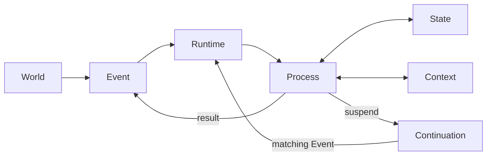
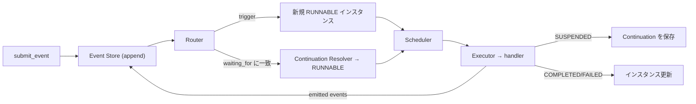
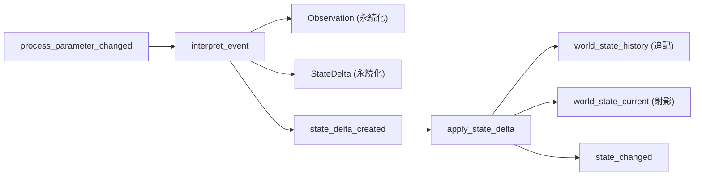
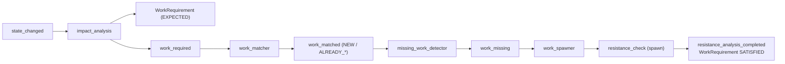
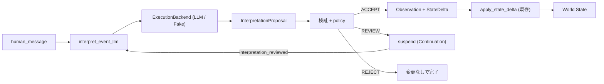
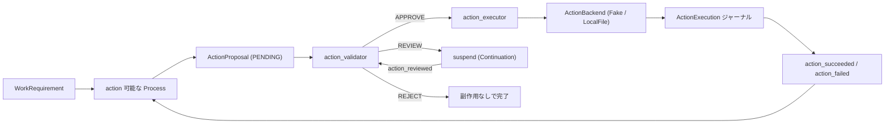
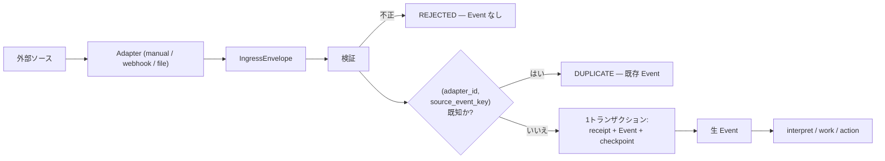

# NEXUS SEED — Core Runtime

*[English version: README.md](README.md)*

NEXUS SEED は**イベント駆動ランタイム**です。外界から Event を受け取り、Process を
起動・中断・再開し、State を更新しながら継続的に動きます。

Phase 1 は AI **ではありません**。以下のコアループを本物にする、可能な限り小さな
ランタイムです。

```
Event → Process → State → Continuation → Event → Resume
```

そこに Phase を重ねて、認識と行動の境界まで到達しています。

| Phase | 内容 |
| --- | --- |
| **1** | コアループ(Event / Process / State / Context / Continuation / Runtime) |
| **2A** | 耐久性(原子性・冪等性・クラッシュ復旧・リトライ・タイマー・spawn/join) |
| **2B** | 意味論的世界モデル(Observation / StateDelta / World State) |
| **2C** | Work Intelligence(変化が要求する仕事の発見と起動) |
| **3A** | Context Compiler / Memory アーキテクチャ |
| **3B** | LLM 知能境界(Proposal → 検証 → Policy) |
| **3C** | Action / Tool 実行境界(世界へ作用する) |
| **3D** | External Observation / Ingress 境界(世界を取り込む) |

---

## 設計原則

- **プリミティブは Process ひとつ。** Skill、Agent、Workflow、Harness、Deep Research、
  常駐モニタ — これらはすべて Process が演じる*役割*であって、別の基底型ではありません。
  Process のデータモデルは1つだけです。(特に Skill と Harness は独立した中核抽象では
  **ありません**。)
- **Definition と Instance を分ける。** `ProcessDefinition` は*何をするか*、
  `ProcessInstance` は*実行中の1コピー*。1つの定義から多数のインスタンスが生まれます。
- **Runtime は機構、Process は知能。** Runtime はイベントの保存とルーティング、
  プロセスの生成・実行・中断・再開、状態の永続化だけを行います。意味と判断はすべて
  process handler の中にあります。
- **Continuation は論理的であってスタックキャプチャではない。** 中断されたプロセスは
  SQLite に書き出して後で再構築できるデータで記述されます。Python のコールスタックは
  決して保存しません。

## コア概念

| 概念 | 内容 |
| --- | --- |
| **Event** | 「何かが起きた」という不変の事実。追記のみ。`correlation_id`(1つの作業単位)と `causation_id`(何が原因か)を持つ。 |
| **Process** | 作業の単位。`ProcessDefinition`(静的)+ `ProcessInstance`(実行中)。全 handler が `async def run(ctx) -> ProcessResult` を共有。 |
| **State** | NEXUS SEED が世界について知っていること。`(entity, attribute) → value` の事実に version と source event が付く。現在は SQLite、グラフ化可能な形。 |
| **Context** | 1回の起動における一時的な作業セット(関連 State + 関連 Event のスナップショット)。State とは別物。チャット履歴ではない。 |
| **Continuation** | 中断した Process の再開方法。`resume_point`、`waiting_for` 条件、`saved_process_state`。完全に永続化可能。 |
| **Runtime** | 全体を束ねる。event store、router、scheduler、executor、continuation resolver、永続化。純粋な機構。 |

## アーキテクチャ



Runtime 内部では、投入された1つのイベントが次のように流れます。



---

## 耐久性 (Phase 2A)

状態を壊さずに動き続けるための土台です。

- **プロセス遷移の原子性。** handler は書き込みをステージング(`ctx.state.set`)し、
  *すべての*効果 — state 変更、発行イベント、continuation の作成/削除、子プロセス、
  タイマー — を1つの `ProcessResult` で返します。Runtime はそれを単一の SQLite
  トランザクションでコミットするか、バッチ全体をロールバックします。
- **冪等性。** 同じ id のイベント再投入は no-op。コミット済みの activation は記録され、
  効果が二重適用されません。
- **クラッシュ復旧。** 起動時、中断された実行によって `RUNNING` のまま残ったプロセスを
  `RUNNABLE` に戻します(コミット済み activation は必ず `RUNNING` から原子的に抜けるので、
  `RUNNING` で止まっているものはコミットされておらず再実行して安全)。
- **リトライ。** handler が `RetryableError` を投げると
  `RUNNING → RETRY_WAIT → RUNNABLE → COMPLETED` と指数バックオフで遷移。通常の例外は
  終端 `FAILED`。
- **タイマー。** プロセスはタイマーで中断できます(`ctx.suspend_on_timer`)。
  `runtime.tick()` が満了タイマーを通常の `timer_fired` イベントとして発火し、プロセスを
  再開します。時刻は注入可能な `Clock` から取るので、テストは高速かつ決定的です。
- **spawn / join。** プロセスは `ctx.spawn_and_join(...)` で子を起動し、`all`/`any` が
  終わるまで中断できます。新しいプリミティブではなく、通常の event + continuation 機構で
  表現されています。

`runtime.tick()` は時間駆動の仕事(タイマー、リトライのバックオフ)を、`submit_event` は
イベント駆動の仕事を進めます。どちらも最後に RUNNABLE なプロセスを全部走らせます。

## 意味論的世界モデル (Phase 2B)

生イベントと世界状態の間に意味の層を置き、4つを区別し続けます。

| | 意味 |
| --- | --- |
| **Event** | 何が起きたか |
| **Observation** | プロセスがそのイベントから*読み取った*こと |
| **StateDelta** | 世界について何が*変わった*と結論したか |
| **World State** | 世界が現在どうであると*信じられている*か |

`Observation` と `StateDelta` は `nexus_seed/world/` 配下の**ドメインデータ**であり、
新しいコアプリミティブではありません。パイプラインは通常のプロセス2つです。



- **履歴が真実の源。** `world_state_history` は追記のみ — 全 `entity.attribute` の
  全バージョンを `valid_from`/`valid_to` 付きで保持します。`world_state_current` は
  射影であり、`runtime.rebuild_current_state()` で完全に再構築できます。
- **来歴 (provenance)。** すべての事実が「なぜそう信じているか」を記録します。
  `runtime.get_state_provenance(entity, attribute)` が Current → History → StateDelta →
  Observation → 生 Event を、DB のみから辿ります。
- **競合検査つきの適用。** `apply_state_delta` は delta の `old_value` を現在状態と
  照合します。不一致はドメインの `StateConflict` です(プロセスは失敗し、何も適用され
  ません — 部分更新は起きない)。
- **原子性の維持。** delta の適用は、履歴行・射影・delta の書き込みと `state_changed` の
  発行を、Phase 2A の単一トランザクション内で行います。

読み取り API: `get_current_state` / `get_state_history` / `get_state_at_version` /
`get_state_provenance` / `rebuild_current_state`

## Work Intelligence (Phase 2C)

世界の変化が*要求する*仕事を自分で発見し、自動で起動します。`Impact`、
`WorkRequirement`、`WorkMatch` は `nexus_seed/work/` 配下の**ドメインデータ**であり、
仕事の実行は依然として通常の `ProcessInstance` です(`Task`/`Agent`/`Skill` という
プリミティブは作りません)。パイプラインが守る境界:

| | 意味 |
| --- | --- |
| **StateDelta** | 世界が変わった |
| **Impact** | その変化にはこういう帰結がある |
| **WorkRequirement** | この仕事が必要だ(*Need*) |
| **ProcessInstance** | この仕事が実行されている |



- **段階の分離。** impact analysis は決して spawn しません。マッチング、欠落検出、
  spawn はイベントで接続された別々のプロセスです。
- **`work_key` による冪等性。** requirement の同一性には state のバージョンが含まれます
  (`resistance_check:D1_CD:v2`)。だから同じ変化を再処理しても仕事は重複せず、
  *新しい*バージョンは本当に新しい仕事になります。
- **マッチング。** `work_matcher` は `work_key` を使って既存プロセスと突き合わせ、
  requirement を `NEW` / `ALREADY_RUNNING` / `ALREADY_COMPLETED` に分類します
  (中断中/実行中のプロセスがあれば再 spawn しない)。
- **決定的なルールのみ。** impact ルールと work→process レジストリは `work/rules.py` に
  あります。Runtime はドメインルールを持ちません。
- **完了。** work プロセスは自分の `WorkRequirement` を宣言的・原子的な副作用として
  `SATISFIED` にします(`ctx.satisfy_work()`)。
- **来歴 / trace。** `runtime.get_work_trace(id)` が ProcessInstance → WorkRequirement →
  StateDelta → Observation → 生 Event を辿ります。*なぜこのプロセスが動いているのか*に
  DB だけで答えられます。

読み取り API: `get_work_requirement` / `get_work_requirements` / `get_work_trace`。
`work_required` / `work_spawned` / `work_satisfied` イベントが work ループに因果の跡を
残します。すべて(requirement の永続化、spawn、状態更新、リンク、発行イベント)が
Phase 2A の原子トランザクション内でコミットされます。

## Context Compiler / Memory アーキテクチャ (Phase 3A)

プロセスは標準入力のためにストアを自由に読むことをやめました。代わりに:

```
Memory (Event / State / Observation / Delta / Work / Process / Continuation)
   → ContextRequirements (ProcessDefinition に宣言)
   → ContextCompiler
   → ProcessContextView (ctx.view)
   → プロセス実行
```

- **Memory** は永続ストア群の総称であって、新しいプリミティブでは*ありません*。
  **Context** は1回の起動のために Memory からコンパイルされる、一時的で再生成可能な
  ビューです。
- **必要なものを宣言する。** `ProcessDefinition` が `ContextRequirements` を持ちます
  (world state の entity、最近の/関連する event、observation、delta、work、
  プロセスツリー、continuation)。宣言がなければ**最小コンテキスト**
  (プロセスインスタンス + トリガーイベントのみ)。
- **選択的かつ決定的。** コンパイラは宣言されたものだけを、固定順で取得します。
  DB 全体を読むことはありません。`ctx.view` は**読み取り専用**で、書き込みは
  `ProcessResult` に留まります。
- **Fresh resume(最重要の性質)。** ビューは毎回の起動で再コンパイルされます。だから
  世界が動いた後に再開したプロセスは、中断時のスナップショットではなく**現在の**状態を
  見ます。Continuation ≠ Context: continuation は*どこから再開するか*を言い、
  context は現在の Memory から作り直されます。
- **来歴。** すべての項目が永続レコードの id を保持します(event id、history id、
  delta id、work id、…)。
- **監査スナップショット。** 各起動のコンパイル済みコンテキストは `context_snapshots` に
  保存されます(`runtime.get_context_snapshots(id)`)。「この起動は何を見ていたか」の
  監査用で、再開には決して使いません。

`resistance_check` は標準入力(現在の target、自分の WorkRequirement、トリガー、
continuation)を `ctx.view` から読みます。`ctx.services` は特別な明示クエリのためだけに
残っています。requirements は定義に永続化されるので、SQLite から再構築した runtime は
同じコンテキストを再コンパイルします。

---

## LLM 知能境界 (Phase 3B)

LLM は **Process から呼ばれる交換可能なバックエンド**であり、Runtime に埋め込まれる
ことは決してありません。その出力は **Proposal** であり、世界に触れる前にゲートを
通ります。

```
LLM → Proposal → スキーマ検証 → 整合性検証 → Policy
    → ACCEPT / REVIEW / REJECT
```



- **厳密な分離。** `LLM出力 ≠ Observation ≠ StateDelta ≠ World State`。**ACCEPT** された
  proposal だけが Observation + StateDelta になり、それは*既存の* Phase 2B
  `apply_state_delta` を流れます — LLM に専用の書き込み経路はありません(不変条件 16–19)。
  受理された proposal はその後、Phase 2C の work パイプラインをそのまま駆動します。
- **交換可能なバックエンド。** `ExecutionBackend` (`backends/`) は `BackendRequest` を
  `BackendResult` に写すだけで、他は何もしません。`LLMBackend`(API キーを環境変数から
  読む)と `FakeLLMBackend`(テストの主力、ネットワーク不要)が同一インターフェースを
  共有します(不変条件 20)。`runtime.register_backend("llm", backend)` で登録し、
  handler は `ctx.backends` から到達します。
- **Runtime ではなく Policy。** `InterpretationPolicy`(閾値)が confidence から
  ACCEPT/REVIEW/REJECT を決めます。**状態競合は confidence を上書きし**、最低でも REVIEW を
  強制します。スキーマ/パース失敗は**リトライ可能**(Phase 2A のリトライ)で、部分的な
  永続化は起きません。
- **人間レビュー = 通常の Event + Continuation。** REVIEW は `interpretation_reviewed` を
  待って中断します。`approve` は再検証してから適用、`reject` は変更なしで終了、`modify` は
  再提案。ランタイムの完全再起動をまたいでも成立します。
- **来歴。** 世界の値 → StateDelta → Observation → InterpretationProposal →
  LLMInvocation → ContextSnapshot → 生 Event を、すべて DB から辿れます。
- **共存。** 決定的な `interpret_event`(`process_parameter_changed` 起動)と LLM の
  `interpret_event_llm`(`human_message` 起動)は両方とも利用可能なままです。

## Action / Tool 実行境界 (Phase 3C)

Phase 3B は認識(世界 → NEXUS SEED)を作りました。Phase 3C はその鏡像である行動
(NEXUS SEED → 世界)を、同じプリミティブの上に作ります。

```
World State / Work → Process → ActionProposal
    → スキーマ → バックエンド能力 → 権限 → リスクポリシー
    → APPROVE / REVIEW / REJECT → ExecutionBackend → ActionExecution
    → action_succeeded / action_failed → Event → 世界
```



- **4つを別物として保つ。** `Processの意図 ≠ ActionProposal ≠ 承認済み proposal ≠
  外部副作用`。handler が外へ出る唯一の経路は `ctx.propose_action(...)` で、これは
  *候補をステージングするだけ*であり、何も実行しません(不変条件 21–22)。
- **権限は定義に付与され、インスタンスが主張するものではない。** `ProcessDefinition` が
  `metadata["permissions"]` を持ちます(既定は空 = 拒否)。さらに各バックエンドの
  action type ごとに**必須**権限が宣言されているので、`required_permissions: []` と
  過少申告した proposal は、こっそり昇格せずに REJECT されます。
- **リスクは設定。** `ActionPolicy` が `RiskLevel` → APPROVE/REVIEW/REJECT を対応づけ、
  validator の定義メタデータに置かれます。未定義のレベルは REVIEW にフォールバック。
  Runtime はリスクのルールを持ちません。
- **人間レビュー = 通常の Event + Continuation**(3B と同じ)。`approve` は行動前に
  **現在の状態に対して再検証**します。`modify` は先頭から検証をやり直す新しい PENDING
  proposal を作ります。再起動をまたいでも成立します。
- **安全モデル: idempotency key ごとに at-most-once** — 分散 exactly-once では明示的に
  *ありません*(2PC なし)。SUCCEEDED な `ActionExecution` が再実行を止め、さらに
  `LocalFileActionBackend` は耐久ジャーナルを持つので、「副作用は成立したが commit が
  失われた」クラッシュ窓でも同じ副作用を繰り返しません。
- **すべての試行を記録。** 失敗・タイムアウト・冪等スキップも含みます。試行ジャーナルは
  リトライによるロールバックを生き延びます(不変条件 26)。リトライは Phase 2A の機構を
  再利用し、バックエンドは自前でリトライしません。
- **結果は state 書き込みではなく Event として戻る。** バックエンドの結果は
  `ActionExecution` ジャーナルと `action_succeeded` の payload に入ります。世界状態を
  変えるには依然として通常の Observation → StateDelta 経路が必要です(不変条件 24–25)。
- **追跡可能。** `runtime.get_action_trace(id)` が execution → proposal → process → work →
  delta → observation → 生 event を辿り、加えて判断時の ContextSnapshot、各判断の権限
  来歴、人間の `action_reviewed` イベントも返します。

## External Observation / Ingress 境界 (Phase 3D)

Phase 3C は世界へ作用させました。Phase 3D は世界が届くようにします — ただし**入口を1つ**に
絞り、再配送や再起動が重複ではなく収束に向かうだけの同一性規律を伴って。

```
外部ソース → Adapter → IngressEnvelope
    → 検証 → 重複排除 → IngressReceipt + 生 Event
    → (既存の認識パイプライン)
```



- **外界の同一性は我々の同一性ではない。** `Event.id` は NEXUS SEED がその出来事を呼ぶ
  名前、`source_event_key` は*世界*がそれを呼ぶ名前です。`(adapter_id,
  source_event_key)` の UNIQUE 制約により、再配送が2つ目の Event になることを止めるのは
  アプリのロジックではなく **DB** です(不変条件 30–31)。この key を決めるのは Adapter
  です — 2つの観測が「同じもの」かどうかを知っているのはそのソースだけだから。key の
  ない envelope はでっち上げるのではなく拒否します。
- **全か無かの取り込み。** receipt・Event・Adapter の checkpoint が1トランザクションで
  コミットされます。Runtime への配送はその commit の*後*に行われるので、処理中の失敗は
  「耐久化済みで重複排除済みのイベント」を残します — 「処理済み扱いなのに一度も走らな
  かった receipt」にはなりません。
- **Checkpoint ≠ Continuation**(不変条件 33)。Continuation は*我々の*プロセスが再開する
  場所、Checkpoint は*世界*をどこまで見たか。checkpoint を失うコストは再観測であって、
  仕事の消失ではありません。
- **Adapter は観測するが解釈しない**(不変条件 34)。file adapter は `allowed_root` 配下の
  バイト列が変わったことを sha256 fingerprint 付きで報告するだけで、ワークブックを開く
  ことはありません。解釈は、提案・検証・監査ができる認識パイプラインに留まります。
- **配送セマンティクス:** at-least-once の取得 + ingress での重複排除。分散
  exactly-once も 2PC もありません。
- **Adapter は3種類。** manual/CLI、汎用 webhook(stdlib asyncio HTTP、共有シークレット
  認証、重複は `200 {"duplicate": true}`)、サンドボックス付きローカルファイル監視。
  webhook は Event が耐久化された時点で応答し、LLM・work パイプライン・action を待ちません。
- **双方向に追跡可能。** `runtime.get_ingress_trace(event_id)` — あるいは provider の
  delivery ID しか手元にないときは `get_ingress_trace_by_source_key(adapter_id, key)` —
  が、それが引き起こした observation、delta、work、action を前向きに辿り、Phase 3C の
  action trace と連結してループを閉じます。

4つの冪等性機構は意図的に**別々のまま**です — `Event.id` (2A)、`work_key` (2C)、
action の `idempotency_key` (3C)、`source_event_key` (3D)。1つの汎用機構に統合すること
なく、互いに矛盾しないことが求められます。

```
1つの実際の外部イベント → 1つの Event → 1つの WorkRequirement → 1つの Action → 1回の副作用
```

---

## リポジトリ構成

```
nexus_seed/
├── core/            # データモデル: event, process, state, context, continuation
├── world/           # 意味論ドメインデータ: observation, state_delta, provenance
├── work/            # work ドメインデータ: work_requirement, impact, work_match,
│                    #   rules, trace
├── context/         # context アーキテクチャ: requirements, models (view/snapshot),
│                    #   compiler
├── backends/        # ExecutionBackend プロトコル + LLMBackend / FakeLLMBackend;
│                    #   ActionBackend + FakeAction / LocalFileAction
├── intelligence/    # proposal, validation, policy (LLM 境界)
├── actions/         # action ドメインデータ: models, permissions, validation,
│                    #   policy, trace (外向き境界)
├── ingress/         # ingress ドメインデータ: models, validation, service, trace
│                    #   (内向き境界)
├── adapters/        # 外部アダプタ: manual, webhook, ローカルファイル監視
├── runtime/         # runtime, router, scheduler, executor, continuation_resolver,
│                    #   clock, join_coordinator, services
├── storage/         # sqlite: database + event/process/state/continuation/timer/
│                    #   join/activation/observation/state_delta/work_requirement/
│                    #   context_snapshot/proposal/llm_invocation/
│                    #   action_proposal/action_execution/action_decision/
│                    #   ingress_receipt/adapter_checkpoint
├── processes/       # 具体的な Process (demo_resistance, semantic,
│                    #   work_intelligence, llm_interpret, actions)
├── ingress_cli.py   # 外部の出来事を手動で1件投入する
└── demo.py          # 実行可能な受け入れシナリオ(ランタイム再起動つき)
tests/               # 全 Phase の受け入れテスト
```

## インストール

Python 3.12 以上。**ランタイム依存はゼロ**です。テストのみ `pytest` +
`pytest-asyncio` を使います。

```bash
python -m venv .venv
.venv\Scripts\activate          # Windows
# source .venv/bin/activate     # macOS / Linux
pip install -e ".[dev]"
```

## テスト

```bash
pytest
```

鍵になるテストは `tests/test_suspend_resume.py` です。プロセスを中断し、**Runtime を
破棄**して同じ SQLite ファイルから新しい Runtime を構築し、そのあとで初めて再開イベントを
配送します — プロセス状態がディスクから完全に復元されることの証明です。

同じ「破棄して再構築する」パターンが各 Phase の要所で繰り返されます:
`test_llm_review_restart.py`(レビュー待ちの LLM proposal)、
`test_action_review_restart.py`(承認待ちの action)、
`test_file_adapter_restart.py`(観測済みファイル)、
`test_ingress_closed_loop.py`(ループ全体)。

## デモ

```bash
python -m nexus_seed.demo
```

Phase 1 の受け入れシナリオが動きます。

1. `process_parameter_changed` を投入(`D1_CD` 48 → 45)。
2. プロセスが起動し、世界状態 `D1_CD.target = 45` を設定。
3. まだ存在しない `W03` の測定値が必要 → `measurement_completed` / `W03` を待つ
   continuation とともに**中断**。
4. **Runtime を破棄**。残るのは SQLite だけ。新しい Runtime を構築。
5. `measurement_completed`(`W03`, `123.4`)を投入。
6. Continuation Resolver がそれをマッチさせ、プロセスを再開。
7. プロセスが完了し、`resistance_analysis_completed` を発行。

## 外部から1件投入する (Phase 3D)

```bash
python -m nexus_seed.ingress_cli --db world.db \
    --event-type human_message \
    --source-event-key demo-001 \
    --payload '{"text": "D1のCD targetを48nmから45nmへ変更しました"}'
```

同じコマンドを2回実行しても no-op です。2回目は `duplicate` を報告し、2つ目の Event は
作られません。webhook の再配送が従うのと同じルールを、最小の規模で見えるようにしたもの
です。`--bootstrap` を付けると、標準の認識 + work + action スタックを登録した状態で
投入できます。

---

## Phase 1 が意図的に除外しているもの

LLM / モデル API、Claude Code、OpenClaw、MCP、メール/Slack、ウェブ検索、ベクタや
グラフのデータベース、埋め込み、GUI、ナレッジグラフ、マルチエージェント
オーケストレーション、自己改変。それらが後から接続される*境界*だけが置かれています。

以降の Phase で、そのうち LLM 境界 (3B)、行動境界 (3C)、観測境界 (3D) が実装されました。
Artifact / Resource 層、動的組織、自己拡張は未着手です。

作業上の取り決めと今後の候補は `AGENTS.md` を参照してください。
