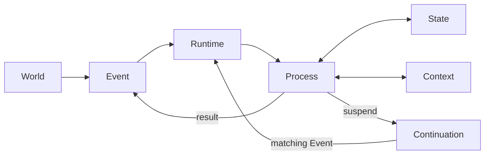
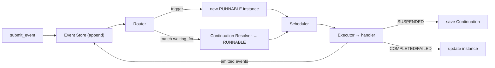
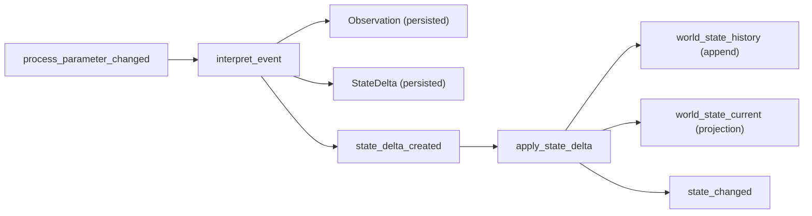

# NEXUS SEED — Core Runtime (Phase 1)

NEXUS SEED is an **event-driven runtime**. It receives Events from the outside
world, starts / suspends / resumes Processes, and updates its State as it runs
continuously.

Phase 1 is **not** the AI. It is the smallest possible runtime that makes the
core loop real:

```
Event → Process → State → Continuation → Event → Resume
```

No LLM, no Claude Code, no MCP, no web search, no mail — Phase 1 deliberately
implements only the *mechanism* those things will later plug into.

## Design principles

- **One primitive: Process.** Skill, Agent, Workflow, Harness, Deep Research,
  a resident monitor — these are *roles* a Process plays, not separate base
  types. There is exactly one Process data model. (In particular, Skill and
  Harness are **not** separate core abstractions.)
- **Definition vs. Instance.** A `ProcessDefinition` says *what* a process does;
  a `ProcessInstance` is one *running* copy. Many instances can come from one
  definition.
- **Runtime is mechanism, Processes are intelligence.** The Runtime stores and
  routes events, creates/runs/suspends/resumes processes, and persists state.
  All meaning and judgement live in process handlers.
- **Continuations are logical, not stack captures.** A suspended process is
  described by data that can be written to SQLite and rebuilt later — never by
  the Python call stack.

## Core concepts

| Concept | What it is |
| --- | --- |
| **Event** | An immutable "something happened" fact. Append-only. Carries `correlation_id` (one unit of work) and `causation_id` (what caused it). |
| **Process** | The unit of work. `ProcessDefinition` (static) + `ProcessInstance` (running). All handlers share `async def run(ctx) -> ProcessResult`. |
| **State** | What NEXUS SEED knows about the world, as `(entity, attribute) → value` facts with a version and source event. SQLite now; graph-ready shape. |
| **Context** | The transient working set for one activation (a snapshot of relevant State + relevant Events). Separate from State; not a chat history. |
| **Continuation** | How a suspended Process resumes: a `resume_point`, a `waiting_for` condition, and `saved_process_state`. Fully persistable. |
| **Runtime** | Ties it together: event store, router, scheduler, executor, continuation resolver, persistence. Pure mechanism. |

## Architecture



Inside the Runtime, one submitted event flows through:



## Durability (Phase 2A)

The runtime is built to run continuously without corrupting state:

- **Atomic process transitions.** A handler stages its writes (`ctx.state.set`)
  and returns *all* effects — state changes, emitted events, continuation
  create/delete, spawned children, timers — in one `ProcessResult`. The runtime
  commits them in a single SQLite transaction, or rolls the whole batch back.
- **Idempotency.** Re-delivering an event (same id) is a no-op; committed
  activations are recorded so effects never apply twice.
- **Crash recovery.** On startup, processes left `RUNNING` by an interrupted
  run are returned to `RUNNABLE` (a committed activation always leaves `RUNNING`
  atomically, so a stuck `RUNNING` never committed and is safe to re-run).
- **Retry.** A handler raising `RetryableError` moves the process
  `RUNNING → RETRY_WAIT → RUNNABLE → COMPLETED` with exponential backoff; plain
  exceptions are terminal `FAILED`.
- **Timers.** A process can suspend on a timer (`ctx.suspend_on_timer`); a
  `runtime.tick()` fires due timers as ordinary `timer_fired` events that resume
  it. Time comes from an injectable `Clock` so tests stay fast and deterministic.
- **Spawn / join.** A process can `ctx.spawn_and_join(...)` children and suspend
  until `all`/`any` finish — expressed with the normal event + continuation
  machinery, not a new primitive.

`runtime.tick()` drives time-based work (timers, retry backoff); `submit_event`
drives event-based work. Both end by draining all `RUNNABLE` processes.

## Semantic world model (Phase 2B)

A meaning layer sits between raw events and world state, keeping four things
distinct:

| | meaning |
| --- | --- |
| **Event** | what happened |
| **Observation** | what a process *read* from the event |
| **StateDelta** | what it concluded *changed* about the world |
| **World State** | how the world is currently *believed* to be |

`Observation` and `StateDelta` are **domain data** under `nexus_seed/world/`,
not new core primitives. The pipeline is two ordinary processes:



- **History is the source of truth.** `world_state_history` is append-only —
  every version of every `entity.attribute`, with `valid_from`/`valid_to`.
  `world_state_current` is a projection and is fully rebuildable with
  `runtime.rebuild_current_state()`.
- **Provenance.** Every fact records why it is believed.
  `runtime.get_state_provenance(entity, attribute)` walks
  Current → History → StateDelta → Observation → raw Event, purely from the DB.
- **Conflict-checked application.** `apply_state_delta` validates a delta's
  `old_value` against current state; a mismatch is a domain `StateConflict`
  (the process fails, nothing is applied — no partial update).
- **Atomicity preserved.** Applying a delta writes the history row, the
  projection, the delta, and emits `state_changed` inside the one Phase 2A
  transaction.

Read APIs: `get_current_state`, `get_state_history`, `get_state_at_version`,
`get_state_provenance`, `rebuild_current_state`.
`state_changed` events are emitted for Phase 2C (Impact Analysis) to consume
later — Phase 2B does not act on them.

## Repository layout

```
nexus_seed/
├── core/            # data models: event, process, state, context, continuation
├── world/           # semantic domain data: observation, state_delta, provenance
├── runtime/         # runtime, router, scheduler, executor, continuation_resolver,
│                    #   clock, join_coordinator
├── storage/         # sqlite: database + event/process/state/continuation/
│                    #   timer/join/activation/observation/state_delta stores
├── processes/       # concrete Processes (demo_resistance, semantic)
└── demo.py          # runnable acceptance scenario (with runtime restart)
tests/               # phase 1: event_store, process_execution, suspend_resume
                     # phase 2a: atomic_transition, idempotency, crash_recovery,
                     #           retry, timer_resume, spawn_join
                     # phase 2b: observation, state_delta, state_history,
                     #           state_provenance, state_conflict,
                     #           state_projection_rebuild, semantic_..._integration
```

## Install

Requires Python 3.12+. No runtime dependencies; tests use `pytest` +
`pytest-asyncio`.

```bash
python -m venv .venv && source .venv/bin/activate
pip install -e ".[dev]"
```

## Test

```bash
pytest
```

The key test is `tests/test_suspend_resume.py`: it suspends a process, **closes
and discards the Runtime**, rebuilds a new Runtime from the same SQLite file,
and only then delivers the resuming event — proving process state is fully
recovered from disk.

## Demo

```bash
python -m nexus_seed.demo
```

This runs the Phase 1 acceptance scenario:

1. Submit `process_parameter_changed` (`D1_CD` 48 → 45).
2. A process starts and sets world state `D1_CD.target = 45`.
3. It needs a `W03` measurement that doesn't exist yet → **suspend** with a
   continuation waiting for `measurement_completed` / `W03`.
4. **Destroy the Runtime**; only SQLite remains. Build a fresh Runtime.
5. Submit `measurement_completed` (`W03`, `123.4`).
6. The Continuation Resolver matches it and resumes the process.
7. The process completes and emits `resistance_analysis_completed`.

## What Phase 1 intentionally excludes

LLM / model APIs, Claude Code, OpenClaw, MCP, mail/Slack, web search, vector or
graph databases, embeddings, GUI, knowledge graph, multi-agent orchestration,
self-modification. Only the boundaries where those will later attach are in
place. See `AGENTS.md` for the working agreement and Phase 2 candidates.
