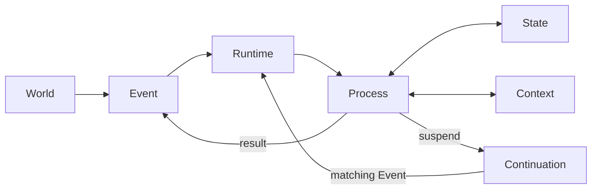
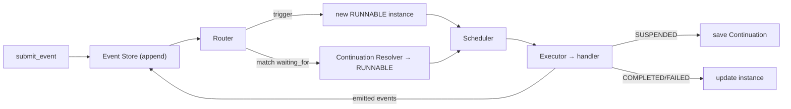
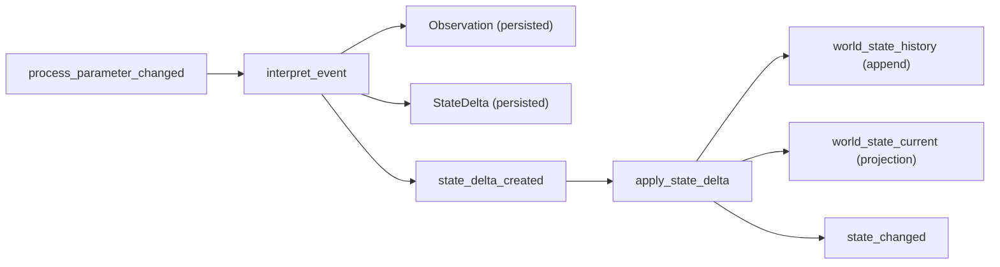
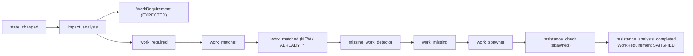
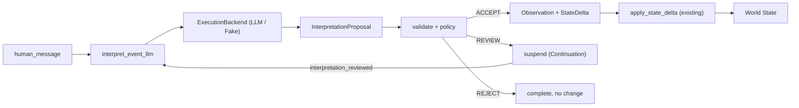
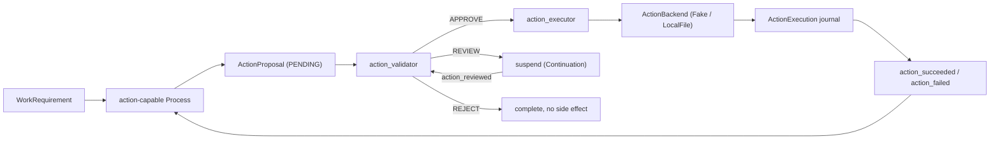
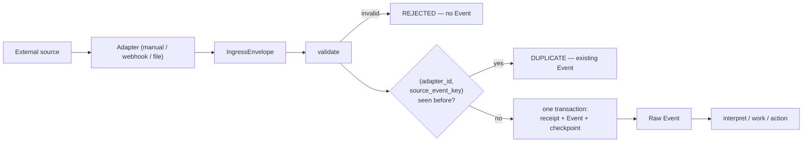

# NEXUS SEED — Core Runtime

*[日本語版: README.ja.md](README.ja.md)*

NEXUS SEED is an **event-driven runtime**. It receives Events from the outside
world, starts / suspends / resumes Processes, and updates its State as it runs
continuously.

Phase 1 is **not** the AI. It is the smallest possible runtime that makes the
core loop real:

```
Event → Process → State → Continuation → Event → Resume
```

Later phases build on that loop without adding a seventh primitive, up to the
boundaries where NEXUS SEED perceives and acts on the real world:

| Phase | What it added |
| --- | --- |
| **1** | The core loop (Event / Process / State / Context / Continuation / Runtime) |
| **2A** | Durability (atomicity, idempotency, crash recovery, retry, timers, spawn/join) |
| **2B** | Semantic world model (Observation / StateDelta / World State) |
| **2C** | Work intelligence (discovering and spawning the work a change requires) |
| **3A** | Context compiler / memory architecture |
| **3B** | LLM intelligence boundary (Proposal → validation → policy) |
| **3C** | Action / tool execution boundary (acting on the world) |
| **3D** | External observation / ingress boundary (taking the world in) |

## Design principles

- **One primitive: Process.** Skill, Agent, Workflow, Harness, Deep Research,
  a resident monitor — these are *roles* a Process plays, not separate base
  types. There is exactly one Process data model. (In particular, Skill and
  Harness are **not** separate core abstractions.)
- **Definition vs. Instance.** A `ProcessDefinition` says *what* a process does;
  a `ProcessInstance` is one *running* copy. Many instances can come from one
  definition.
- **Runtime is mechanism, Processes are intelligence.** The Runtime stores and
  routes events, creates/runs/suspends/resumes processes, and persists state.
  All meaning and judgement live in process handlers.
- **Continuations are logical, not stack captures.** A suspended process is
  described by data that can be written to SQLite and rebuilt later — never by
  the Python call stack.

## Core concepts

| Concept | What it is |
| --- | --- |
| **Event** | An immutable "something happened" fact. Append-only. Carries `correlation_id` (one unit of work) and `causation_id` (what caused it). |
| **Process** | The unit of work. `ProcessDefinition` (static) + `ProcessInstance` (running). All handlers share `async def run(ctx) -> ProcessResult`. |
| **State** | What NEXUS SEED knows about the world, as `(entity, attribute) → value` facts with a version and source event. SQLite now; graph-ready shape. |
| **Context** | The transient working set for one activation (a snapshot of relevant State + relevant Events). Separate from State; not a chat history. |
| **Continuation** | How a suspended Process resumes: a `resume_point`, a `waiting_for` condition, and `saved_process_state`. Fully persistable. |
| **Runtime** | Ties it together: event store, router, scheduler, executor, continuation resolver, persistence. Pure mechanism. |

## Architecture



Inside the Runtime, one submitted event flows through:



## Durability (Phase 2A)

The runtime is built to run continuously without corrupting state:

- **Atomic process transitions.** A handler stages its writes (`ctx.state.set`)
  and returns *all* effects — state changes, emitted events, continuation
  create/delete, spawned children, timers — in one `ProcessResult`. The runtime
  commits them in a single SQLite transaction, or rolls the whole batch back.
- **Idempotency.** Re-delivering an event (same id) is a no-op; committed
  activations are recorded so effects never apply twice.
- **Crash recovery.** On startup, processes left `RUNNING` by an interrupted
  run are returned to `RUNNABLE` (a committed activation always leaves `RUNNING`
  atomically, so a stuck `RUNNING` never committed and is safe to re-run).
- **Retry.** A handler raising `RetryableError` moves the process
  `RUNNING → RETRY_WAIT → RUNNABLE → COMPLETED` with exponential backoff; plain
  exceptions are terminal `FAILED`.
- **Timers.** A process can suspend on a timer (`ctx.suspend_on_timer`); a
  `runtime.tick()` fires due timers as ordinary `timer_fired` events that resume
  it. Time comes from an injectable `Clock` so tests stay fast and deterministic.
- **Spawn / join.** A process can `ctx.spawn_and_join(...)` children and suspend
  until `all`/`any` finish — expressed with the normal event + continuation
  machinery, not a new primitive.

`runtime.tick()` drives time-based work (timers, retry backoff); `submit_event`
drives event-based work. Both end by draining all `RUNNABLE` processes.

## Semantic world model (Phase 2B)

A meaning layer sits between raw events and world state, keeping four things
distinct:

| | meaning |
| --- | --- |
| **Event** | what happened |
| **Observation** | what a process *read* from the event |
| **StateDelta** | what it concluded *changed* about the world |
| **World State** | how the world is currently *believed* to be |

`Observation` and `StateDelta` are **domain data** under `nexus_seed/world/`,
not new core primitives. The pipeline is two ordinary processes:



- **History is the source of truth.** `world_state_history` is append-only —
  every version of every `entity.attribute`, with `valid_from`/`valid_to`.
  `world_state_current` is a projection and is fully rebuildable with
  `runtime.rebuild_current_state()`.
- **Provenance.** Every fact records why it is believed.
  `runtime.get_state_provenance(entity, attribute)` walks
  Current → History → StateDelta → Observation → raw Event, purely from the DB.
- **Conflict-checked application.** `apply_state_delta` validates a delta's
  `old_value` against current state; a mismatch is a domain `StateConflict`
  (the process fails, nothing is applied — no partial update).
- **Atomicity preserved.** Applying a delta writes the history row, the
  projection, the delta, and emits `state_changed` inside the one Phase 2A
  transaction.

Read APIs: `get_current_state`, `get_state_history`, `get_state_at_version`,
`get_state_provenance`, `rebuild_current_state`.

## Work intelligence (Phase 2C)

NEXUS SEED now discovers the work a world change *requires* and spawns it
automatically. `Impact`, `WorkRequirement`, `WorkMatch` are **domain data**
under `nexus_seed/work/` — work is still executed as ordinary `ProcessInstance`s
(no `Task`/`Agent`/`Skill` primitive). The boundary the pipeline preserves:

| | meaning |
| --- | --- |
| **StateDelta** | the world changed |
| **Impact** | that change has these consequences |
| **WorkRequirement** | this work needs doing (a *Need*) |
| **ProcessInstance** | this work is being done |



- **Separated stages.** Impact analysis never spawns; matching, missing-work
  detection and spawning are distinct processes connected by events.
- **`work_key` idempotency.** A requirement's identity includes the state
  version (`resistance_check:D1_CD:v2`), so re-processing a change never
  duplicates work, and a *new* version is genuinely new work.
- **Matching.** `work_matcher` classifies a requirement `NEW` /
  `ALREADY_RUNNING` / `ALREADY_COMPLETED` against existing processes by
  `work_key` (a suspended/running process ⇒ no re-spawn).
- **Deterministic rules only.** Impact rules and the work→process registry live
  in `work/rules.py`; the Runtime holds no domain rules.
- **Completion.** A work process marks its `WorkRequirement` `SATISFIED` as a
  declarative, atomic side effect (`ctx.satisfy_work()`).
- **Provenance / trace.** `runtime.get_work_trace(id)` walks ProcessInstance →
  WorkRequirement → StateDelta → Observation → raw Event — *why is this process
  running?*, answered from the DB.

Read APIs: `get_work_requirement`, `get_work_requirements`, `get_work_trace`.
`work_required` / `work_spawned` / `work_satisfied` events give the work loop a
causal trail. Everything (requirement persist, spawn, status updates, links,
emitted events) commits inside the Phase 2A atomic transaction.

## Context compiler / memory architecture (Phase 3A)

Processes no longer read the stores freely for their standard inputs. Instead:

```
Memory (Event / State / Observation / Delta / Work / Process / Continuation)
   → ContextRequirements (declared on the ProcessDefinition)
   → ContextCompiler
   → ProcessContextView (ctx.view)
   → Process execution
```

- **Memory** is the collective name for the persistent stores — *not* a new
  primitive. **Context** is a temporary, regenerable view compiled from Memory
  for one activation.
- **Declared needs.** A `ProcessDefinition` carries `ContextRequirements`
  (world-state entities, recent/related events, observations, deltas, work,
  process tree, continuation). No requirements ⇒ **minimal context**
  (process instance + trigger event only).
- **Selective & deterministic.** The compiler pulls only what's declared, in a
  fixed order — never the whole DB. `ctx.view` is **read-only**; writes stay in
  `ProcessResult`.
- **Fresh resume (the key property).** The view is recompiled every activation,
  so a process resumed after the world moved on sees the **current** state, not
  a suspend-time snapshot. Continuation ≠ Context: the continuation says where
  to resume; the context is recompiled from current Memory.
- **Provenance.** Every item keeps its persistent record id (event id, history
  id, delta id, work id, …).
- **Audit snapshots.** Each activation's compiled context is saved to
  `context_snapshots` (via `runtime.get_context_snapshots(id)`) — an audit of
  "what did this activation see", never used to resume.

`resistance_check` reads its standard inputs (current target, its
WorkRequirement, trigger, continuation) from `ctx.view`; `ctx.services` remains
only for special explicit queries. Requirements persist on the definition, so a
runtime rebuilt from SQLite recompiles the same context.

## LLM intelligence boundary (Phase 3B)

The LLM is a **swappable backend called from a Process** — never embedded in the
Runtime. Its output is a **Proposal**, gated before it can touch the world:

```
LLM → Proposal → Schema validation → Consistency validation → Policy
    → ACCEPT / REVIEW / REJECT
```



- **Strict separation.** `LLM output ≠ Observation ≠ StateDelta ≠ World State`.
  Only an **ACCEPTED** proposal becomes an Observation + StateDelta, which flow
  through the *existing* Phase 2B `apply_state_delta` — the LLM has no private
  write path (Invariants 16–19). An accepted proposal then drives the full
  Phase 2C work pipeline unchanged.
- **Swappable backend.** `ExecutionBackend` (`backends/`) maps a
  `BackendRequest` to a `BackendResult` and does nothing else. `LLMBackend`
  (reads its API key from the env) and `FakeLLMBackend` (test workhorse, no
  network) share one interface (Invariant 20). Register with
  `runtime.register_backend("llm", backend)`; handlers reach it via
  `ctx.backends`.
- **Policy, not Runtime.** `InterpretationPolicy` (thresholds) decides
  ACCEPT/REVIEW/REJECT from confidence; a **state conflict overrides confidence**
  and forces at least REVIEW. Schema/parse failures are **retryable** (Phase 2A
  retry); nothing partial is persisted.
- **Human review = ordinary Event + Continuation.** REVIEW suspends waiting for
  `interpretation_reviewed`; `approve` re-validates and applies, `reject` ends
  with no change, `modify` re-proposes. Survives a full runtime restart.
- **Provenance.** World value → StateDelta → Observation → InterpretationProposal
  → LLMInvocation → ContextSnapshot → raw Event, all from the DB.
- **Coexistence.** The deterministic `interpret_event` (on
  `process_parameter_changed`) and the LLM `interpret_event_llm` (on
  `human_message`) both remain available.

## Action / tool execution boundary (Phase 3C)

Phase 3B built perception (world → NEXUS SEED). Phase 3C builds the mirror
image, action (NEXUS SEED → world), on the same primitives:

```
World State / Work → Process → ActionProposal
    → Schema → Backend capability → Permission → Risk policy
    → APPROVE / REVIEW / REJECT → ExecutionBackend → ActionExecution
    → action_succeeded / action_failed → Event → World
```



- **Four things stay distinct.** `Process intention ≠ ActionProposal ≠ approved
  proposal ≠ external side effect`. A handler's only route outward is
  `ctx.propose_action(...)`, which *stages a candidate* — it never executes
  anything (Invariants 21–22).
- **Permissions are granted to definitions, not claimed by instances.** A
  `ProcessDefinition` carries `metadata["permissions"]` (default: none). Every
  backend action type also declares **mandatory** permissions, so a proposal
  that under-declares (`required_permissions: []`) is rejected rather than
  quietly escalating.
- **Risk is configuration.** `ActionPolicy` maps `RiskLevel` →
  APPROVE/REVIEW/REJECT and lives in the validator's definition metadata;
  an unmapped level falls back to REVIEW. The Runtime holds no risk rules.
- **Human review = ordinary Event + Continuation**, as in 3B. `approve`
  **re-validates against current state** before acting; `modify` produces a new
  PENDING proposal that re-enters validation from the top. Survives a restart.
- **Safety model: at-most-once per idempotency key** — explicitly *not*
  distributed exactly-once (no 2PC). A SUCCEEDED `ActionExecution` blocks
  re-execution, and `LocalFileActionBackend` keeps a durable journal so even the
  "effect landed, commit lost" crash window does not repeat the effect.
- **Every attempt is recorded**, including failures, timeouts and idempotent
  skips — the attempt journals survive the rollback a retry causes
  (Invariant 26). Retries reuse the Phase 2A mechanism; backends never retry.
- **Results come back as Events, not state writes.** A backend result lands in
  the `ActionExecution` journal and an `action_succeeded` payload; changing
  world state still requires the ordinary Observation → StateDelta path
  (Invariants 24–25).
- **Traceable.** `runtime.get_action_trace(id)` walks execution → proposal →
  process → work → delta → observation → raw event, plus the ContextSnapshot
  the decision was made against, the permission provenance of each decision,
  and any human `action_reviewed` events.

## External observation / ingress boundary (Phase 3D)

Phase 3C let NEXUS SEED act on the world; Phase 3D lets the world reach it —
through one door, with an identity discipline strong enough that redeliveries
and restarts converge instead of duplicating:

```
External source → Adapter → IngressEnvelope
    → validation → deduplication → IngressReceipt + Raw Event
    → (the existing perception pipeline)
```



- **External identity is not our identity.** `Event.id` is what NEXUS SEED calls
  an occurrence; `source_event_key` is what the *world* calls it. A UNIQUE index
  on `(adapter_id, source_event_key)` means the database — not application
  logic — is what stops a redelivery becoming a second Event (Invariants 30–31).
  The adapter chooses that key, because only it knows what makes two
  observations "the same thing"; an envelope without one is refused rather than
  given an invented key.
- **All-or-nothing intake.** The receipt, the Event and the adapter's checkpoint
  commit in one transaction. Delivery into the Runtime happens *after* that
  commit, so a failure while processing leaves a durable, already-deduplicated
  event — never a receipt marking an occurrence handled that never ran.
- **Checkpoint ≠ Continuation** (Invariant 33). A Continuation is where *our*
  process resumes; a Checkpoint is how much of the *world* we have looked at.
  Losing a checkpoint costs a re-observation, not lost work.
- **Adapters observe, they do not interpret** (Invariant 34). The file adapter
  reports that bytes under `allowed_root` changed, with a sha256 fingerprint —
  it never opens the workbook. Interpretation stays in the perception pipeline
  where it is proposed, validated and auditable.
- **Delivery semantics:** at-least-once acquisition plus deduplication at
  ingress. No distributed exactly-once, no 2PC.
- **Three adapters ship:** manual/CLI, generic webhook (stdlib asyncio HTTP,
  shared-secret auth, duplicate → `200 {"duplicate": true}`), and a sandboxed
  local file watcher. A webhook returns as soon as the Event is durable; it
  never waits for the LLM, the work pipeline or an action.
- **Traceable in both directions.** `runtime.get_ingress_trace(event_id)` — or
  `get_ingress_trace_by_source_key(adapter_id, key)`, when all you have is the
  provider's delivery id — walks forward to the observations, deltas, work and
  actions it caused, and joins the Phase 3C action trace to close the loop.

The four idempotency mechanisms stay deliberately separate — `Event.id` (2A),
`work_key` (2C), action `idempotency_key` (3C), `source_event_key` (3D) — and
must agree without being merged into one general mechanism:

```
1 real external event → 1 Event → 1 WorkRequirement → 1 Action → 1 side effect
```

## Repository layout

```
nexus_seed/
├── core/            # data models: event, process, state, context, continuation
├── world/           # semantic domain data: observation, state_delta, provenance
├── work/            # work domain data: work_requirement, impact, work_match,
│                    #   rules, trace
├── context/         # context architecture: requirements, models (view/snapshot),
│                    #   compiler
├── backends/        # ExecutionBackend protocol + LLMBackend / FakeLLMBackend;
│                    #   ActionBackend + FakeAction / LocalFileAction
├── intelligence/    # proposal, validation, policy (the LLM boundary)
├── actions/         # action domain data: models, permissions, validation,
│                    #   policy, trace (the outward boundary)
├── ingress/         # ingress domain data: models, validation, service, trace
│                    #   (the inward boundary)
├── adapters/        # external adapters: manual, webhook, local file watcher
├── runtime/         # runtime, router, scheduler, executor, continuation_resolver,
│                    #   clock, join_coordinator, services
├── storage/         # sqlite: database + event/process/state/continuation/timer/
│                    #   join/activation/observation/state_delta/work_requirement/
│                    #   context_snapshot/proposal/llm_invocation/
│                    #   action_proposal/action_execution/action_decision/
│                    #   ingress_receipt/adapter_checkpoint
├── processes/       # concrete Processes (demo_resistance, semantic,
│                    #   work_intelligence, llm_interpret, actions)
├── ingress_cli.py   # submit one external occurrence by hand
└── demo.py          # runnable acceptance scenario (with runtime restart)
tests/               # phase 1: event_store, process_execution, suspend_resume
                     # phase 2a: atomic_transition, idempotency, crash_recovery,
                     #           retry, timer_resume, spawn_join
                     # phase 2b: observation, state_delta, state_history,
                     #           state_provenance, state_conflict,
                     #           state_projection_rebuild, semantic_..._integration
                     # phase 2c: work_requirement, impact_analysis, work_matching,
                     #           missing_work_detection, work_spawn,
                     #           work_idempotency, work_trace, work_..._integration
                     # phase 3a: context_requirements, context_compiler,
                     #           context_selective_state, context_events,
                     #           context_work, context_process_tree,
                     #           context_continuation, context_fresh_resume,
                     #           context_snapshot, context_restart
                     # phase 3b: llm_backend, interpretation_proposal,
                     #           proposal_validation, proposal_policy,
                     #           llm_interpret_high_confidence, llm_interpret_review,
                     #           llm_human_approve, llm_human_reject,
                     #           llm_review_restart, llm_conflict, llm_retry,
                     #           llm_trace, llm_work_integration
                     # phase 3c: action_proposal, action_validation,
                     #           action_policy, action_permissions,
                     #           action_backend, action_auto_approve,
                     #           action_review, action_review_restart,
                     #           action_reject, action_retry,
                     #           action_idempotency, action_trace,
                     #           action_context_trace, action_file_sandbox,
                     #           action_boundary, action_work_integration,
                     #           llm_invocation_logging
                     # phase 3d: ingress_models, ingress_service,
                     #           ingress_duplicate, ingress_atomicity,
                     #           manual_adapter, webhook_adapter, webhook_auth,
                     #           file_adapter, file_adapter_restart,
                     #           file_adapter_sandbox, adapter_checkpoint,
                     #           ingress_trace, ingress_llm_integration,
                     #           ingress_closed_loop,
                     #           ingress_duplicate_closed_loop
```

## Install

Requires Python 3.12+. No runtime dependencies; tests use `pytest` +
`pytest-asyncio`.

```bash
python -m venv .venv
.venv\Scripts\activate          # Windows
# source .venv/bin/activate     # macOS / Linux
pip install -e ".[dev]"
```

## Test

```bash
pytest
```

The key test is `tests/test_suspend_resume.py`: it suspends a process, **closes
and discards the Runtime**, rebuilds a new Runtime from the same SQLite file,
and only then delivers the resuming event — proving process state is fully
recovered from disk.

That same discard-and-rebuild pattern recurs at every phase boundary:
`test_llm_review_restart.py` (an LLM proposal awaiting review),
`test_action_review_restart.py` (an action awaiting approval),
`test_file_adapter_restart.py` (files already observed), and
`test_ingress_closed_loop.py` (the whole loop).

## Demo

```bash
python -m nexus_seed.demo
```

This runs the Phase 1 acceptance scenario:

1. Submit `process_parameter_changed` (`D1_CD` 48 → 45).
2. A process starts and sets world state `D1_CD.target = 45`.
3. It needs a `W03` measurement that doesn't exist yet → **suspend** with a
   continuation waiting for `measurement_completed` / `W03`.
4. **Destroy the Runtime**; only SQLite remains. Build a fresh Runtime.
5. Submit `measurement_completed` (`W03`, `123.4`).
6. The Continuation Resolver matches it and resumes the process.
7. The process completes and emits `resistance_analysis_completed`.

## Submitting one external occurrence (Phase 3D)

```bash
python -m nexus_seed.ingress_cli --db world.db \
    --event-type human_message \
    --source-event-key demo-001 \
    --payload '{"text": "D1のCD targetを48nmから45nmへ変更しました"}'
```

Running the same command twice is a no-op: the second call reports `duplicate`
and creates no second Event — the same rule a webhook redelivery obeys, made
visible at the smallest possible scale. Add `--bootstrap` to register the
standard perception + work + action stack before ingesting.

## What Phase 1 intentionally excludes

LLM / model APIs, Claude Code, OpenClaw, MCP, mail/Slack, web search, vector or
graph databases, embeddings, GUI, knowledge graph, multi-agent orchestration,
self-modification. Only the boundaries where those will later attach are in
place.

Later phases filled in three of those boundaries — the LLM boundary (3B), the
action boundary (3C) and the observation boundary (3D). The Artifact / Resource
layer, dynamic organization and self extension remain unbuilt. See `AGENTS.md`
for the working agreement and the current later-phase candidates.
