# NEXUS SEED — Core Runtime

*[English](architecture.md) · [全体像](system-overview.ja.md) · [簡潔なREADME](../README.ja.md)*

NEXUS SEED は**イベント駆動ランタイム**です。外界から Event を受け取り、Process を
起動・中断・再開し、State を更新しながら継続的に動きます。

Phase 1 は AI **ではありません**。以下のコアループを本物にする、可能な限り小さな
ランタイムです。

```
Event → Process → State → Continuation → Event → Resume
```

そこに Phase を重ねて、認識と行動の境界まで到達しています。

| Phase | 内容 |
| --- | --- |
| **1** | コアループ(Event / Process / State / Context / Continuation / Runtime) |
| **2A** | 耐久性(原子性・冪等性・クラッシュ復旧・リトライ・タイマー・spawn/join) |
| **2B** | 意味論的世界モデル(Observation / StateDelta / World State) |
| **2C** | Work Intelligence(変化が要求する仕事の発見と起動) |
| **3A** | Context Compiler / Memory アーキテクチャ |
| **3B** | LLM 知能境界(Proposal → 検証 → Policy) |
| **3C** | Action / Tool 実行境界(世界へ作用する) |
| **3D** | External Observation / Ingress 境界(世界を取り込む) |
| **3E** | Artifact / Resource 層 + 長寿命 Observer Process |
| **3F** | 耐久 Event 配送(永続化された Event は決して忘れられない) |
| **4A** | Capability Registry — 仕事は名前ではなく能力で Process を見つける |
| **4B** | 動的合成 — 複数 Process を永続 Plan として組み立てて実行する |
| **4B.1** | 合成の硬化 — 明示的データ束縛、分岐 DAG、有界 drain |
| **4C** | Plan 意思決定層 — 評価、決定論的/LLM支援選択、人手レビュー、有界replanning |
| **5A** | Capability Gap 分析とレビュー付き ExtensionProposal |
| **5B** | Sandbox 内 Capability 構築と多層検証 |
| **5C** | レビュー付き Installation / Production smoke / Activation |
| **5D** | Policy と Budget で制限された自律 Capability Acquisition Loop |
| **5E** | Capability Provider Federation、Skill import、永続 Agent delegation |

---

## 設計原則

- **プリミティブは Process ひとつ。** Skill、Agent、Workflow、Harness、Deep Research、
  常駐モニタ — これらはすべて Process が演じる*役割*であって、別の基底型ではありません。
  Process のデータモデルは1つだけです。(特に Skill と Harness は独立した中核抽象では
  **ありません**。)
- **Definition と Instance を分ける。** `ProcessDefinition` は*何をするか*、
  `ProcessInstance` は*実行中の1コピー*。1つの定義から多数のインスタンスが生まれます。
- **Runtime は機構、Process は知能。** Runtime はイベントの保存とルーティング、
  プロセスの生成・実行・中断・再開、状態の永続化だけを行います。意味と判断はすべて
  process handler の中にあります。
- **Continuation は論理的であってスタックキャプチャではない。** 中断されたプロセスは
  SQLite に書き出して後で再構築できるデータで記述されます。Python のコールスタックは
  決して保存しません。

## コア概念

| 概念 | 内容 |
| --- | --- |
| **Event** | 「何かが起きた」という不変の事実。追記のみ。`correlation_id`(1つの作業単位)と `causation_id`(何が原因か)を持つ。 |
| **Process** | 作業の単位。`ProcessDefinition`(静的)+ `ProcessInstance`(実行中)。全 handler が `async def run(ctx) -> ProcessResult` を共有。 |
| **State** | NEXUS SEED が世界について知っていること。`(entity, attribute) → value` の事実に version と source event が付く。現在は SQLite、グラフ化可能な形。 |
| **Context** | 1回の起動における一時的な作業セット(関連 State + 関連 Event のスナップショット)。State とは別物。チャット履歴ではない。 |
| **Continuation** | 中断した Process の再開方法。`resume_point`、`waiting_for` 条件、`saved_process_state`。完全に永続化可能。 |
| **Runtime** | 全体を束ねる。event store、router、scheduler、executor、continuation resolver、永続化。純粋な機構。 |

## アーキテクチャ

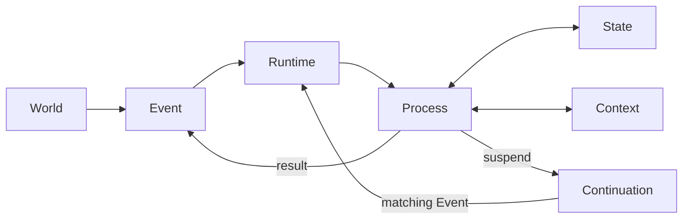

Runtime 内部では、投入された1つのイベントが次のように流れます。

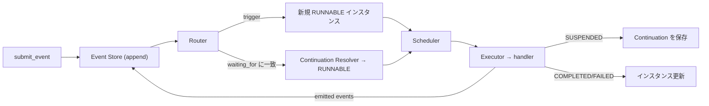

---

## 耐久性 (Phase 2A)

状態を壊さずに動き続けるための土台です。

- **プロセス遷移の原子性。** handler は書き込みをステージング(`ctx.state.set`)し、
  *すべての*効果 — state 変更、発行イベント、continuation の作成/削除、子プロセス、
  タイマー — を1つの `ProcessResult` で返します。Runtime はそれを単一の SQLite
  トランザクションでコミットするか、バッチ全体をロールバックします。
- **冪等性。** 同じ id のイベント再投入は no-op。コミット済みの activation は記録され、
  効果が二重適用されません。
- **クラッシュ復旧。** 起動時、中断された実行によって `RUNNING` のまま残ったプロセスを
  `RUNNABLE` に戻します(コミット済み activation は必ず `RUNNING` から原子的に抜けるので、
  `RUNNING` で止まっているものはコミットされておらず再実行して安全)。
- **リトライ。** handler が `RetryableError` を投げると
  `RUNNING → RETRY_WAIT → RUNNABLE → COMPLETED` と指数バックオフで遷移。通常の例外は
  終端 `FAILED`。
- **タイマー。** プロセスはタイマーで中断できます(`ctx.suspend_on_timer`)。
  `runtime.tick()` が満了タイマーを通常の `timer_fired` イベントとして発火し、プロセスを
  再開します。時刻は注入可能な `Clock` から取るので、テストは高速かつ決定的です。
- **spawn / join。** プロセスは `ctx.spawn_and_join(...)` で子を起動し、`all`/`any` が
  終わるまで中断できます。新しいプリミティブではなく、通常の event + continuation 機構で
  表現されています。

`runtime.tick()` は時間駆動の仕事(タイマー、リトライのバックオフ)を、`submit_event` は
イベント駆動の仕事を進めます。どちらも最後に RUNNABLE なプロセスを全部走らせます。

## 意味論的世界モデル (Phase 2B)

生イベントと世界状態の間に意味の層を置き、4つを区別し続けます。

| | 意味 |
| --- | --- |
| **Event** | 何が起きたか |
| **Observation** | プロセスがそのイベントから*読み取った*こと |
| **StateDelta** | 世界について何が*変わった*と結論したか |
| **World State** | 世界が現在どうであると*信じられている*か |

`Observation` と `StateDelta` は `nexus_seed/world/` 配下の**ドメインデータ**であり、
新しいコアプリミティブではありません。パイプラインは通常のプロセス2つです。

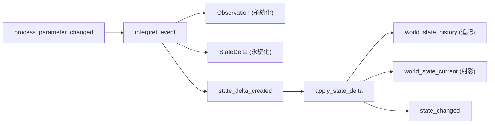

- **履歴が真実の源。** `world_state_history` は追記のみ — 全 `entity.attribute` の
  全バージョンを `valid_from`/`valid_to` 付きで保持します。`world_state_current` は
  射影であり、`runtime.rebuild_current_state()` で完全に再構築できます。
- **来歴 (provenance)。** すべての事実が「なぜそう信じているか」を記録します。
  `runtime.get_state_provenance(entity, attribute)` が Current → History → StateDelta →
  Observation → 生 Event を、DB のみから辿ります。
- **競合検査つきの適用。** `apply_state_delta` は delta の `old_value` を現在状態と
  照合します。不一致はドメインの `StateConflict` です(プロセスは失敗し、何も適用され
  ません — 部分更新は起きない)。
- **原子性の維持。** delta の適用は、履歴行・射影・delta の書き込みと `state_changed` の
  発行を、Phase 2A の単一トランザクション内で行います。

読み取り API: `get_current_state` / `get_state_history` / `get_state_at_version` /
`get_state_provenance` / `rebuild_current_state`

## Work Intelligence (Phase 2C)

世界の変化が*要求する*仕事を自分で発見し、自動で起動します。`Impact`、
`WorkRequirement`、`WorkMatch` は `nexus_seed/work/` 配下の**ドメインデータ**であり、
仕事の実行は依然として通常の `ProcessInstance` です(`Task`/`Agent`/`Skill` という
プリミティブは作りません)。パイプラインが守る境界:

| | 意味 |
| --- | --- |
| **StateDelta** | 世界が変わった |
| **Impact** | その変化にはこういう帰結がある |
| **WorkRequirement** | この仕事が必要だ(*Need*) |
| **ProcessInstance** | この仕事が実行されている |

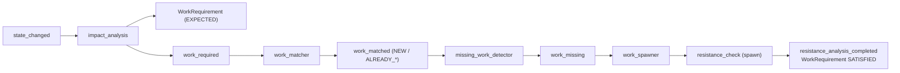

- **段階の分離。** impact analysis は決して spawn しません。マッチング、欠落検出、
  spawn はイベントで接続された別々のプロセスです。
- **`work_key` による冪等性。** requirement の同一性には state のバージョンが含まれます
  (`resistance_check:D1_CD:v2`)。だから同じ変化を再処理しても仕事は重複せず、
  *新しい*バージョンは本当に新しい仕事になります。
- **マッチング。** `work_matcher` は `work_key` を使って既存プロセスと突き合わせ、
  requirement を `NEW` / `ALREADY_RUNNING` / `ALREADY_COMPLETED` に分類します
  (中断中/実行中のプロセスがあれば再 spawn しない)。
- **決定的なルールのみ。** impact ルールと work→process レジストリは `work/rules.py` に
  あります。Runtime はドメインルールを持ちません。
- **完了。** work プロセスは自分の `WorkRequirement` を宣言的・原子的な副作用として
  `SATISFIED` にします(`ctx.satisfy_work()`)。
- **来歴 / trace。** `runtime.get_work_trace(id)` が ProcessInstance → WorkRequirement →
  StateDelta → Observation → 生 Event を辿ります。*なぜこのプロセスが動いているのか*に
  DB だけで答えられます。

読み取り API: `get_work_requirement` / `get_work_requirements` / `get_work_trace`。
`work_required` / `work_spawned` / `work_satisfied` イベントが work ループに因果の跡を
残します。すべて(requirement の永続化、spawn、状態更新、リンク、発行イベント)が
Phase 2A の原子トランザクション内でコミットされます。

## Context Compiler / Memory アーキテクチャ (Phase 3A)

プロセスは標準入力のためにストアを自由に読むことをやめました。代わりに:

```
Memory (Event / State / Observation / Delta / Work / Process / Continuation)
   → ContextRequirements (ProcessDefinition に宣言)
   → ContextCompiler
   → ProcessContextView (ctx.view)
   → プロセス実行
```

- **Memory** は永続ストア群の総称であって、新しいプリミティブでは*ありません*。
  **Context** は1回の起動のために Memory からコンパイルされる、一時的で再生成可能な
  ビューです。
- **必要なものを宣言する。** `ProcessDefinition` が `ContextRequirements` を持ちます
  (world state の entity、最近の/関連する event、observation、delta、work、
  プロセスツリー、continuation)。宣言がなければ**最小コンテキスト**
  (プロセスインスタンス + トリガーイベントのみ)。
- **選択的かつ決定的。** コンパイラは宣言されたものだけを、固定順で取得します。
  DB 全体を読むことはありません。`ctx.view` は**読み取り専用**で、書き込みは
  `ProcessResult` に留まります。
- **Fresh resume(最重要の性質)。** ビューは毎回の起動で再コンパイルされます。だから
  世界が動いた後に再開したプロセスは、中断時のスナップショットではなく**現在の**状態を
  見ます。Continuation ≠ Context: continuation は*どこから再開するか*を言い、
  context は現在の Memory から作り直されます。
- **来歴。** すべての項目が永続レコードの id を保持します(event id、history id、
  delta id、work id、…)。
- **監査スナップショット。** 各起動のコンパイル済みコンテキストは `context_snapshots` に
  保存されます(`runtime.get_context_snapshots(id)`)。「この起動は何を見ていたか」の
  監査用で、再開には決して使いません。

`resistance_check` は標準入力(現在の target、自分の WorkRequirement、トリガー、
continuation)を `ctx.view` から読みます。`ctx.services` は特別な明示クエリのためだけに
残っています。requirements は定義に永続化されるので、SQLite から再構築した runtime は
同じコンテキストを再コンパイルします。

---

## LLM 知能境界 (Phase 3B)

LLM は **Process から呼ばれる交換可能なバックエンド**であり、Runtime に埋め込まれる
ことは決してありません。その出力は **Proposal** であり、世界に触れる前にゲートを
通ります。

```
LLM → Proposal → スキーマ検証 → 整合性検証 → Policy
    → ACCEPT / REVIEW / REJECT
```

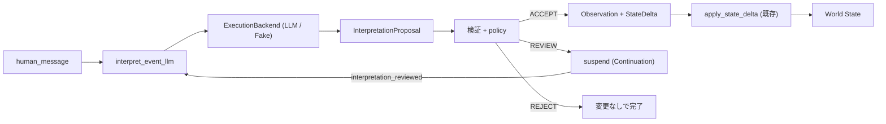

- **厳密な分離。** `LLM出力 ≠ Observation ≠ StateDelta ≠ World State`。**ACCEPT** された
  proposal だけが Observation + StateDelta になり、それは*既存の* Phase 2B
  `apply_state_delta` を流れます — LLM に専用の書き込み経路はありません(不変条件 16–19)。
  受理された proposal はその後、Phase 2C の work パイプラインをそのまま駆動します。
- **交換可能なバックエンド。** `ExecutionBackend` (`backends/`) は `BackendRequest` を
  `BackendResult` に写すだけで、他は何もしません。`LLMBackend`(API キーを環境変数から
  読む)と `FakeLLMBackend`(テストの主力、ネットワーク不要)が同一インターフェースを
  共有します(不変条件 20)。`runtime.register_backend("llm", backend)` で登録し、
  handler は `ctx.backends` から到達します。実 LLM の出力はまず厳格な JSON として
  解析します。失敗した場合に限り `json-repair` で一度修復して再解析し、その後は
  従来どおり proposal の検証・Policy 境界を通します。
- **状態変更なしの契約。** `proposed_state_deltas` は応答の必須フィールドですが、配列は
  空でも構いません。明示的な空配列は永続的な状態変更がないという解釈を表し、受理された
  Observation は記録可能ですが `StateDelta` は生成しません。フィールドの欠落・型不正は
  既存の bounded retry へ進み、穴埋めのための Delta を捏造しません。失敗した試行は
  Invocation journal に残ります。
- **Runtime ではなく Policy。** `InterpretationPolicy`(閾値)が confidence から
  ACCEPT/REVIEW/REJECT を決めます。**状態競合は confidence を上書きし**、最低でも REVIEW を
  強制します。スキーマ/パース失敗は**リトライ可能**(Phase 2A のリトライ)で、部分的な
  永続化は起きません。
- **人間レビュー = 通常の Event + Continuation。** REVIEW は `interpretation_reviewed` を
  待って中断します。`approve` は再検証してから適用、`reject` は変更なしで終了、`modify` は
  再提案。ランタイムの完全再起動をまたいでも成立します。
- **来歴。** 世界の値 → StateDelta → Observation → InterpretationProposal →
  LLMInvocation → ContextSnapshot → 生 Event を、すべて DB から辿れます。
- **共存。** 決定的な `interpret_event`(`process_parameter_changed` 起動)と LLM の
  `interpret_event_llm`(`human_message` 起動)は両方とも利用可能なままです。

## Action / Tool 実行境界 (Phase 3C)

Phase 3B は認識(世界 → NEXUS SEED)を作りました。Phase 3C はその鏡像である行動
(NEXUS SEED → 世界)を、同じプリミティブの上に作ります。

```
World State / Work → Process → ActionProposal
    → スキーマ → バックエンド能力 → 権限 → リスクポリシー
    → APPROVE / REVIEW / REJECT → ExecutionBackend → ActionExecution
    → action_succeeded / action_failed → Event → 世界
```

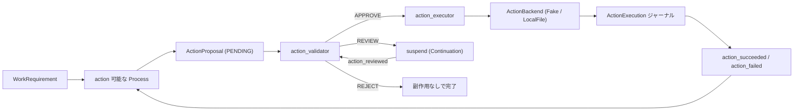

- **4つを別物として保つ。** `Processの意図 ≠ ActionProposal ≠ 承認済み proposal ≠
  外部副作用`。handler が外へ出る唯一の経路は `ctx.propose_action(...)` で、これは
  *候補をステージングするだけ*であり、何も実行しません(不変条件 21–22)。
- **権限は定義に付与され、インスタンスが主張するものではない。** `ProcessDefinition` が
  `metadata["permissions"]` を持ちます(既定は空 = 拒否)。さらに各バックエンドの
  action type ごとに**必須**権限が宣言されているので、`required_permissions: []` と
  過少申告した proposal は、こっそり昇格せずに REJECT されます。
- **リスクは設定。** `ActionPolicy` が `RiskLevel` → APPROVE/REVIEW/REJECT を対応づけ、
  validator の定義メタデータに置かれます。未定義のレベルは REVIEW にフォールバック。
  Runtime はリスクのルールを持ちません。
- **人間レビュー = 通常の Event + Continuation**(3B と同じ)。`approve` は行動前に
  **現在の状態に対して再検証**します。`modify` は先頭から検証をやり直す新しい PENDING
  proposal を作ります。再起動をまたいでも成立します。
- **安全モデル: idempotency key ごとに at-most-once** — 分散 exactly-once では明示的に
  *ありません*(2PC なし)。SUCCEEDED な `ActionExecution` が再実行を止め、さらに
  `LocalFileActionBackend` は耐久ジャーナルを持つので、「副作用は成立したが commit が
  失われた」クラッシュ窓でも同じ副作用を繰り返しません。
- **すべての試行を記録。** 失敗・タイムアウト・冪等スキップも含みます。試行ジャーナルは
  リトライによるロールバックを生き延びます(不変条件 26)。リトライは Phase 2A の機構を
  再利用し、バックエンドは自前でリトライしません。
- **結果は state 書き込みではなく Event として戻る。** バックエンドの結果は
  `ActionExecution` ジャーナルと `action_succeeded` の payload に入ります。世界状態を
  変えるには依然として通常の Observation → StateDelta 経路が必要です(不変条件 24–25)。
- **追跡可能。** `runtime.get_action_trace(id)` が execution → proposal → process → work →
  delta → observation → 生 event を辿り、加えて判断時の ContextSnapshot、各判断の権限
  来歴、人間の `action_reviewed` イベントも返します。

## External Observation / Ingress 境界 (Phase 3D)

Phase 3C は世界へ作用させました。Phase 3D は世界が届くようにします — ただし**入口を1つ**に
絞り、再配送や再起動が重複ではなく収束に向かうだけの同一性規律を伴って。

```
外部ソース → Adapter → IngressEnvelope
    → 検証 → 重複排除 → IngressReceipt + 生 Event
    → (既存の認識パイプライン)
```

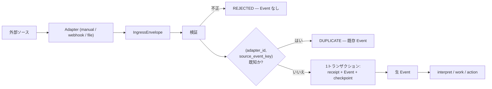

- **外界の同一性は我々の同一性ではない。** `Event.id` は NEXUS SEED がその出来事を呼ぶ
  名前、`source_event_key` は*世界*がそれを呼ぶ名前です。`(adapter_id,
  source_event_key)` の UNIQUE 制約により、再配送が2つ目の Event になることを止めるのは
  アプリのロジックではなく **DB** です(不変条件 30–31)。この key を決めるのは Adapter
  です — 2つの観測が「同じもの」かどうかを知っているのはそのソースだけだから。key の
  ない envelope はでっち上げるのではなく拒否します。
- **全か無かの取り込み。** receipt・Event・Adapter の checkpoint が1トランザクションで
  コミットされます。Runtime への配送はその commit の*後*に行われるので、処理中の失敗は
  「耐久化済みで重複排除済みのイベント」を残します — 「処理済み扱いなのに一度も走らな
  かった receipt」にはなりません。
- **Checkpoint ≠ Continuation**(不変条件 33)。Continuation は*我々の*プロセスが再開する
  場所、Checkpoint は*世界*をどこまで見たか。checkpoint を失うコストは再観測であって、
  仕事の消失ではありません。
- **Adapter は観測するが解釈しない**(不変条件 34)。file adapter は `allowed_root` 配下の
  バイト列が変わったことを sha256 fingerprint 付きで報告するだけで、ワークブックを開く
  ことはありません。解釈は、提案・検証・監査ができる認識パイプラインに留まります。
- **配送セマンティクス:** at-least-once の取得 + ingress での重複排除。分散
  exactly-once も 2PC もありません。
- **Adapter は3種類。** manual/CLI、汎用 webhook(stdlib asyncio HTTP、共有シークレット
  認証、重複は `200 {"duplicate": true}`)、サンドボックス付きローカルファイル監視。
  webhook は Event が耐久化された時点で応答し、LLM・work パイプライン・action を待ちません。
- **双方向に追跡可能。** `runtime.get_ingress_trace(event_id)` — あるいは provider の
  delivery ID しか手元にないときは `get_ingress_trace_by_source_key(adapter_id, key)` —
  が、それが引き起こした observation、delta、work、action を前向きに辿り、Phase 3C の
  action trace と連結してループを閉じます。

4つの冪等性機構は意図的に**別々のまま**です — `Event.id` (2A)、`work_key` (2C)、
action の `idempotency_key` (3C)、`source_event_key` (3D)。1つの汎用機構に統合すること
なく、互いに矛盾しないことが求められます。

```
1つの実際の外部イベント → 1つの Event → 1つの WorkRequirement → 1つの Action → 1回の副作用
```

---

## Artifact / Resource 層 + 長寿命 Observer (Phase 3E)

Phase 3D は「ファイルが変わった」までしか言えませんでした。Phase 3E はそれが**何であるか**を
言い、履歴を保ち、Process が使える表現として渡します。そして 3D で残っていた
「誰が `poll()` を呼ぶのか」に答えます。

```
外部ファイル → Ingress → file event → Resource + ResourceVersion
    → Representation → Context Compiler → Process → ActionProposal → 世界
```

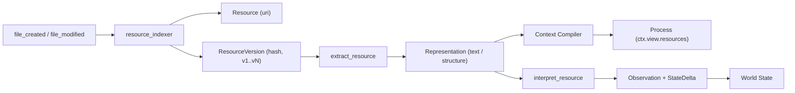

- **3階層を分けたまま保つ。** `Resource` はそのモノが*何であるか*(URI で一意)、
  `ResourceVersion` はある時点で*何を含んでいたか*(immutable・連番・content hash)、
  `ResourceRepresentation` はその内容から*何を作ったか*。どの2つを混ぜても実害が
  出ます。Resource を content hash で識別すればファイル編集のたびに履歴が消え、
  Representation を Version ではなく Resource に付ければ、ファイルが変わった後に
  「AIは実際に何を読んだのか」に答えられなくなります。
- **抽出はエンジン機能ではなく Process**(不変条件 38)。Extractor は決定的な
  registry に登録された純粋関数です(`PlainText` / `JSON` / `CSV`)。後から Office や
  PDF に対応するのは registry への登録であって、Runtime の変更ではありません。
  Adapter は依然として内容を解釈しません(3D のルールは維持)。
- **重複排除は2箇所。** その Resource が既に持っている content hash と一致するなら
  新しい version を作らないので、変わっていないファイルを何度観測しても増えません。
  Representation の同一性には extractor の*バージョン*が含まれるので、extractor を
  改良すると過去の描画を黙って書き換えるのではなく、隣に新しいものが作られます。
- **文書は Context 経由で Process に届きます。** `ContextRequirements.resources` で
  宣言し、選択は決定的(明示 id / URI、process input、work metadata)。
  **embedding も類似度ランキングも使いません** — snapshot 監査が意味を持つには
  compiler が再現可能でなければならないからです。`max_bytes` は truncate か exclude で、
  要約は決してしません。
- **fresh resume が文書にも及びます**(不変条件 40)。v1 の仕様書を持ったまま中断した
  Process は、再開時に v2 を読みます。ContextSnapshot は逆方向に働き、各起動が読んだ
  version と描画を記録するので、ファイルが先に進んでも当時の答えが残ります
  (不変条件 39)。
- **常駐 Observer はただの Process**(不変条件 41)。`watch_files` は adapter を poll し、
  ingest し、timer で中断します。tick と tick の間、それは SQLite の1行と Continuation
  でしかありません。クラッシュ復旧も再起動安全性もタダで継承し、再起動しても2つ目の
  インスタンスにはならず同じものが再開します。`watch_mail` / `watch_git` も同じ形で
  書けます。daemon 抽象は追加していません。
- **path 境界はひとつ。** `ResourceScope` が Phase 3C と 3D で別々に育っていた
  `allowed_root` チェックを置き換え、read と write を別の権能として扱います。
  path のみが対象で、sandbox ではありません。

## 耐久 Event 配送 (Phase 3F)

Event を保存しただけでは足りません。イベント駆動システムが誠実であるためには、
永続化されたすべての Event が**必ず Router に届く**ことが保証されている必要があります。
そうでなければ、悪いタイミングでの crash が「DB に存在するのに誰も反応しない事実」を
残します。

Phase 3E にはまさにその穴がありました。Ingress 境界が receipt と一緒に Event を
commit し、その後それを route するはずだった observer が失敗しうる。source key は
消費済みなので、再 poll しても戻ってきません。

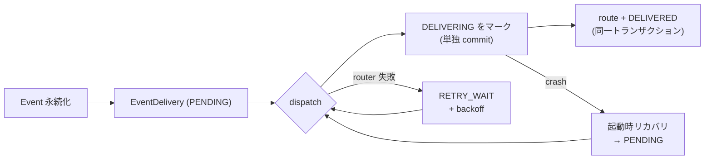

- **永続化と配送は別の事実**(不変条件 42)。`EventDelivery` は Event 1件につき1行で、
  `EventStore.append` が **Event 自身と同一トランザクション**で作ります。だからどの
  呼び出し箇所も「Event を保存したが、誰かが見る約束を忘れた」状態を作れません
  (不変条件 43)。
- **「配送済み」とは routing 結果が commit されたこと**であって、`route()` を呼んだ
  ことではありません。acknowledgement は生成された activation と同一トランザクションに
  乗るので、「Process は作られたが Event は未確認」という状態は存在し得ません。
  `trigger_event_id` による独立したガードも併設しています。
- **中断された作業が見える。** routing 前に `DELIVERING` を単独 commit するので、
  route 途中の crash は起動時リカバリが `PENDING` に戻せる痕跡を残します。Phase 2A の
  `RUNNING` sweep と同じ論法です。
- **1件の詰まった Event が queue 全体を止めない。** backoff 中の delivery は待つのでは
  なく飛ばされ、後続の Event は流れ続けます。
- **at-least-once 配送、結果は1回。** retry 安全性は各 Phase が積み上げてきた層ごとの
  冪等性から来ます。1つのエンジンに統合せず、別々のまま保ちます。
- **`events_to_route` は廃止。** observer は ingest して終わりで、その activation が
  commit されようとされまいと、obligation が Event を先へ運びます(不変条件 47)。
  `deliver_event()` は optimization としてのみ残ります(不変条件 46)。
- **旧 DB は `DELIVERED` として backfill**(`PENDING` にはしない)。稼働中システムの
  全履歴を replay してしまうためです。

正確に言うと: **Phase 3F 以降に永続化された Event は、明示的に FAILED として停止され
ない限り、最終的に必ず Router へ配送されます。**

## Capability Registry (Phase 4A)

これまで、仕事は名前で実装を見つけていました。`work_type` をハードコードされた表で
引く方式です。それは**誰かが事前にその表を書いておいた範囲でのみ**機能します。
Phase 4A は、その参照を問いに置き換えます。

```
WorkRequirement → 必要 Capability → CapabilityRegistry
    → 候補 ProcessDefinition → 決定的マッチング
    → 実行可能な Process 1つ、または記録されたギャップ
```

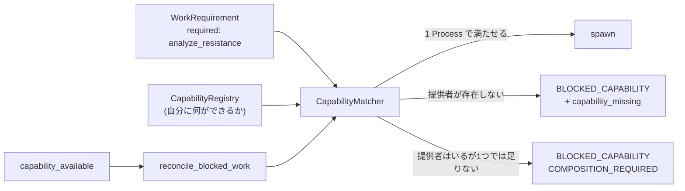

- **「Capability」と呼ばれる2つを分けたまま保つ。** Phase 3C の
  `BackendCapabilities` は*道具*が機械的に何をできるか(`write_file`)。ここでの
  `Capability` は*Process* が何を成し遂げられるか(`analyze_resistance`)。
  道具は能力ではありません。
- **ギャップは Need を取り消さない。** 実行できる Process がなければ
  `BLOCKED_CAPABILITY` になり、不足していた Capability が記録されます。決して
  `CANCELLED` にはしません。取り消せば、*こちら側の*一時的な限界を理由に実在する
  要求を捨てることになり、後から能力を獲得しても二度と復活できません。これは将来の
  Self Extension が読むことになる記録です。
- **3つの結果を意図的に区別する。** 一致した / *そもそもできない* / *提供者は全部
  いるが1つの Process では満たせない*。最後のものは**解かずに記録**します。
  Process の組み合わせは Phase 4B であり、ここで黙ってやれば planner を密輸する
  ことになります。
- **マッチングは厳密かつ再現可能。** LLM も embedding も類似度ランキングも使いません。
  同点は明示的な `capability_priority`、次に新しい definition version、次に名前で
  決まります — どのマシンでも、再起動後も同じ答えになります。description や tags は
  保存しますが、マッチングには使いません。
- **能力の獲得は reconcile であって replay ではない。** capable な Process を登録すると
  `capability_available` が append され、blocked だった**既存の** requirement が
  matcher へ再提示されます — 同じ id、同じ来歴、raw event の再配送はゼロ。
- **すべての判断が監査可能。** 各試行が、検討された候補・それぞれに何が足りなかったか・
  何を選びなぜ選んだかを記録します。試行は蓄積されるので、月曜に blocked で火曜に
  matched になった requirement は両方を示します。
- **旧経路も動く。** Capability を宣言しない仕事は名前表にフォールバックするので、
  既存の D1_CD シナリオは同じ Process に到達します。変わったのは選択原理であって、
  結果ではありません。

概念的にはこれは World State のもう半分です。World State は NEXUS SEED が*外界*に
ついて知っていること、Capability Registry は*自分自身*について知っていること。
そう言うために `SelfModel` primitive を追加はしていません。

## 動的 Process 合成 (Phase 4B)

Phase 4A は仕事全体を1つで担える Process を見つけ、いなければギャップを記録できました。
そのギャップの1つが興味深いものでした — `COMPOSITION_REQUIRED`、つまり**必要な能力は
すべて存在するが、複数の Process に散らばっている**状態です。Phase 4B はそれらが
合算されるような順序を導出します。

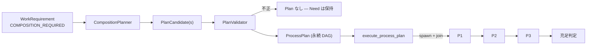

- **PlanNode は「位置」であって実行体ではない。** ProcessDefinition を指名するだけで、
  実際に動くのは依然として `ProcessInstance` です。実行には既存の spawn / join /
  continuation をそのまま使うため、原子的遷移・クラッシュ復旧・activation 冪等性が、
  どれ1つ Plan を知ることなく合成 Plan にも適用されます。
- **決定的・有界・厳密。** 必要 Capability と必要 output type からの後ろ向き連鎖で、
  接続は**シンボリックな型の完全一致**のみ。node 数・深さ・候補数の明示的上限があるので、
  探索は常にハングではなく答えで終わります。**LLM は一切使いません** — どの構成が最善かを
  推論できるようになる前に、そもそも構成が存在するかへの再現可能な答えが要るからです。
- **Plan は DAG であり、Planner が提案しただけのものは実行されない。** cycle は拒否
  (ループは Process の内側に属します)。検証は合成時と、各 stage の spawn 直前の2回 —
  その間に definition が disable されうるからです。
- **完了した node は二度と実行しない。** `(plan_id, node_key)` は UNIQUE で、spawn は
  同一トランザクション内で node と instance を結びます。だから最初のステップの後に
  crash しても、再開は最初からではなく2番目からです。node には副作用があるので、これが
  「復旧」と「新しいバグ」の分かれ目になります。
- **失敗は巻き戻さないし、Need を取り消さない。** node の失敗は Plan を失敗させますが、
  それ以前の結果は残り、compensation を勝手に作ることはせず、requirement は開いたままです。
- **全 node 完了 ≠ 仕事が終わった。** 充足判定は別に行います — Capability の網羅と、
  必要な output type が**実際に**生成されたこと。全 Process が走ったが必要なものを何も
  生成しなかった Plan は COMPLETED であって **SATISFIED ではありません**。

Phase 4B ではさらに `ProcessResult` を整理しました。effect のリストが20余りまで増えて
いたためです。リスト自体は残し(既存 handler はすべてそのまま動く)、`result.effects` と
`result.lifecycle` はその上のグルーピング view です。そしてより重要なこととして、
**矛盾した staged effect は activation を失敗させる**ようになりました — リスト順で
解決するのではなく。これは Phase 4A で実際に踏んだバグ(Capability 選択の記録が、同じ
handler 内で直前に設定した work status を静かに上書きしていた)を塞ぎます。

## 合成の硬化 (Phase 4B.1)

Phase 4B は複数 Process を Plan に組み立てられました。しかし、組み立てた Plan を
**常に説明できるわけではありませんでした**。Phase 4C が合成の上に判断を載せる前に
真でなければならないことが3つあり、この Phase はそれを真にするためだけのものです —
新しい能力なし、LLM なし、再計画なし。

### edge は順序ではなくデータフローそのもの

Phase 4B の edge は「ある node が別の node に供給する」ことだけを記録し、値は実行時に
型で探していました。同じ型の producer が2つあると、consumer は executor がたまたま先に
訪れた方を受け取ります。Plan は値の出所を説明できず、同じ Plan の2回の実行が
食い違いうる状態でした。

いまや edge は両端 — 供給側の port と消費側の port — を名指しし、executor は型を
探すのではなく **edge を辿ります**。**port** は `type` または `type:key` と書き、
2つの measurement を受け取る Process はどちらがどちらかを言えます:

```
measurement            任意の measurement
measurement:measured   "measured" と呼ばれる方
```

計画時に決まっていないことは、実行時には何も決まりません。key なしの port は
**供給側では**ワイルドカードのままですが、消費側では宣言と完全一致が必要です。
port の名前は、値が渡ってくるときの key そのものだからです。

### 曖昧さは解決せず、拒否する

2つの node が1つの input を供給でき、どちらかを決めるものが何もない場合、planner は
その input を未接続のまま残し、validator が input 名と両方の候補を挙げて Plan を
落とします。片方を選んでも**動いてしまう** — それが危険なところです。`BindingStatus`
は区別すべき診断を分けています: `AMBIGUOUS_BINDING`(producer が多すぎる)、
`MISSING_INPUT`(いない)、`DUPLICATE_BINDING`、`TYPE_MISMATCH`、`INVALID_PORT`。

「1つの consumer input に producer は1つ」は validator だけでなく UNIQUE index でも
強制され、`save_edge` は衝突する insert を握り潰さなくなりました。この組み合わせが
Phase 4B の実バグを見つけました — 1つの node が別の node の2つの keyed input を
供給するとき、2本目の edge が黙って捨てられ、consumer は input を1つ欠いたまま走り、
それでも Plan は成功を報告していたのです。原因となった制約を緩めるため、
`plan_edges` テーブルは open 時に再構築されます。

### 分岐は前提ではなくテスト対象

Phase 4B は並列 spawn と多入力 join を実装しておきながら、実際には直列しか流して
いませんでした。`P1 → {P2, P3} → P4` は受け入れケースになりました — fan-out し、
両 branch が1 stage で走り、join は遅い方を待ち、片方完了・片方 activation 途中で
中断した状態からの再起動でも、2つ目を spawn せず**同じ instance に再接続**します。

### 1回の runtime 呼び出しは全部ではなく一切れだけ

drain はこれまで世界が静まるまで走っていました。短い連鎖なら問題ありませんが、長い
Plan では問題になり、自分の次の event を自分で作れる Process では致命的です — 他所で
どれだけ気をつけても復旧できないハングでした。

```python
from nexus_seed.runtime.drain import DrainBudget

await runtime.submit_event(event, DrainBudget(max_activations=10))
while runtime.last_drain.has_remaining:
    await runtime.drain(DrainBudget(max_activations=10))
```

**budget に到達することは失敗ではありません。** FAILED になるものはなく、event は
捨てられず、Plan も放棄されません — すべてすでに永続化されているので、次の呼び出しが
続きを引き受けます。dispatch と execute は交互に進むので、配送キューが長くても実行が
飢えることはありません。budget は呼び出しのパラメータであって永続状態ではありません。
再起動した runtime は「前回どう刻まれたか」を一切知らされず、結果はスライスの切れ目に
依存しません。

デフォルトは無制限なので、4B.1 以前の呼び出し側の挙動は完全に変わりません。

### この値はどこから来たのか

`PlanTrace.bindings` は node 単位ではなく port 単位でそれに答え、`inputs_given` は
各位置が**実際に**渡されたものを読み戻します:

```python
trace = runtime.get_plan_trace(plan_id)
[b.describe() for b in trace.bindings_into("compare:v1")]
# ['measure:v1.reading:measured -> compare:v1.reading:measured',
#  'lookup_reference:v1.reading:reference -> compare:v1.reading:reference']
```

binding が存在しなかった頃に書かれた古い Plan は、**意味が一意なときだけ**尊重され、
そうでなければ BLOCKED になります。推測すれば、この Phase が取り除いたはずの曖昧さを
そのまま再生産することになるからです。

## Plan 選択とreplanning (Phase 4C)

合成自体は引き続き決定論的です。有限個の候補DAGを生成・検証した後にだけ、
Phase 4Cの判断層が動きます。

```text
WorkRequirement
  -> 検証済み候補Plan
  -> 決定論的評価とhard constraint
  -> 決定論的選択、または任意のLLM SelectionProposal
  -> 再検証 / confidence policy / 通常の人手レビューContinuation
  -> 選択された1つのPlan
  -> 成功、またはterminal failure -> durable replan_required -> 新しいPlan
```

LLMはPlan graphを返さず、提示された候補外を選べません。存在しないPlanや
driftしたPlanは実行されず、backend/schema障害は通常のretry上限後に決定論的
selectorへfallbackします。評価、proposal、LLM invocation、selection、replan
attemptは監査履歴として永続化されます。失敗Planは書き換えず、Needを残した
まま現在のCapability Registryと再コンパイルした関連World Stateで再検討します。
`max_replans`到達時もcancelせず`BLOCKED_PLAN`になります。

Plan-level approvalとAction approvalは別の安全境界です。選択済みPlan内の
high-risk Actionも、Phase 3Cのpermission/risk reviewを必ず通ります。

## リポジトリ構成

```
nexus_seed/
├── core/            # データモデル: event, process, state, context, continuation
├── world/           # 意味論ドメインデータ: observation, state_delta, provenance
├── work/            # work ドメインデータ: work_requirement, impact, work_match,
│                    #   rules, trace
├── context/         # context アーキテクチャ: requirements, models (view/snapshot),
│                    #   compiler
├── backends/        # ExecutionBackend プロトコル + LLMBackend / FakeLLMBackend;
│                    #   ActionBackend + FakeAction / LocalFileAction
├── intelligence/    # proposal, validation, policy (LLM 境界)
├── actions/         # action ドメインデータ: models, permissions, validation,
│                    #   policy, trace (外向き境界)
├── ingress/         # ingress ドメインデータ: models, validation, service, trace
│                    #   (内向き境界)
├── adapters/        # 外部アダプタ: manual, webhook, ローカルファイル監視
├── resources/       # Artifact 層: models, scope, service, extractors, trace
├── delivery/        # 耐久 Event 配送: models + dispatcher
├── capabilities/    # 自分に何ができるか: models, registry, matcher, trace
├── planning/        # 合成: models (Port を含む), planner, validation, trace
├── runtime/         # runtime, router, scheduler, executor, continuation_resolver,
│                    #   clock, join_coordinator, drain, services
├── storage/         # sqlite: database + event/process/state/continuation/timer/
│                    #   join/activation/observation/state_delta/work_requirement/
│                    #   context_snapshot/proposal/llm_invocation/
│                    #   action_proposal/action_execution/action_decision/
│                    #   ingress_receipt/adapter_checkpoint/resource/
│                    #   event_delivery/capability/plan
├── processes/       # 具体的な Process (demo_resistance, semantic,
│                    #   work_intelligence, llm_interpret, actions, resources)
├── ingress_cli.py   # 外部の出来事を手動で1件投入する
└── demo.py          # 実行可能な受け入れシナリオ(ランタイム再起動つき)
tests/               # 全 Phase の受け入れテスト
```

## インストール

Python 3.12 以上。ランタイム依存は、壊れた LLM JSON のフォールバック修復にのみ使う
`json-repair` 1つです。テストには `pytest` + `pytest-asyncio` を使います。

```bash
python -m venv .venv
.venv\Scripts\activate          # Windows
# source .venv/bin/activate     # macOS / Linux
pip install -e ".[dev]"
```

## テスト

```bash
pytest
```

鍵になるテストは `tests/test_suspend_resume.py` です。プロセスを中断し、**Runtime を
破棄**して同じ SQLite ファイルから新しい Runtime を構築し、そのあとで初めて再開イベントを
配送します — プロセス状態がディスクから完全に復元されることの証明です。

同じ「破棄して再構築する」パターンが各 Phase の要所で繰り返されます:
`test_llm_review_restart.py`(レビュー待ちの LLM proposal)、
`test_action_review_restart.py`(承認待ちの action)、
`test_file_adapter_restart.py`(観測済みファイル)、
`test_ingress_closed_loop.py`(ループ全体)、
`test_watch_files_restart.py`(常駐 Observer)、
`test_resource_versioning.py`(Resource の版履歴)、
`test_event_delivery_closed_loop.py`(全ステップ間で Runtime を再構築)。

## デモ

```bash
python -m nexus_seed.demo
```

Phase 1 の受け入れシナリオが動きます。

1. `process_parameter_changed` を投入(`D1_CD` 48 → 45)。
2. プロセスが起動し、世界状態 `D1_CD.target = 45` を設定。
3. まだ存在しない `W03` の測定値が必要 → `measurement_completed` / `W03` を待つ
   continuation とともに**中断**。
4. **Runtime を破棄**。残るのは SQLite だけ。新しい Runtime を構築。
5. `measurement_completed`(`W03`, `123.4`)を投入。
6. Continuation Resolver がそれをマッチさせ、プロセスを再開。
7. プロセスが完了し、`resistance_analysis_completed` を発行。

## 外部から1件投入する (Phase 3D)

```bash
python -m nexus_seed.ingress_cli --db world.db \
    --event-type human_message \
    --source-event-key demo-001 \
    --payload '{"text": "D1のCD targetを48nmから45nmへ変更しました"}'
```

同じコマンドを2回実行しても no-op です。2回目は `duplicate` を報告し、2つ目の Event は
作られません。webhook の再配送が従うのと同じルールを、最小の規模で見えるようにしたもの
です。`--bootstrap` を付けると、標準の認識 + work + action スタックを登録した状態で
投入できます。

---

## Phase 1 が意図的に除外しているもの

LLM / モデル API、Claude Code、OpenClaw、MCP、メール/Slack、ウェブ検索、ベクタや
グラフのデータベース、埋め込み、GUI、ナレッジグラフ、マルチエージェント
オーケストレーション、自己改変。それらが後から接続される*境界*だけが置かれています。

以降の Phase で、LLM (3B)、行動 (3C)、観測 (3D)、Artifact (3E)、Capability
(4A)、合成と判断 (4B–4C)、自己拡張Proposal (5A)、Sandbox構築 (5B)、人間承認付き
Production昇格 (5C) の境界が実装されました。Office / PDF の抽出、Delegation、
動的組織、自律的なCapability Acquisition Loopは未着手です。

作業上の取り決めと今後の候補は `AGENTS.md` を参照してください。

## Sandbox内Capability構築（Phase 5B）

承認済みの `ExtensionProposal` は、Productionを変更せずに実物のartifactへ
変換し、Capability Contractまで検証できるようになりました。

```text
ExtensionProposal APPROVED
  -> ConstructionPlan validation
  -> dedicated SandboxWorkspace + ConstructionGrant
  -> ActionProposal経由のartifact write
  -> Resource / ResourceVersion / Representation provenance
  -> structural + static/test + behavior verification
  -> ConstructionResult VERIFIED
```

`VERIFIED` は `INSTALLED` でも `ACTIVE` でもありません。Workspaceはsealされ、
一時Grantはrevokeされます。Capability Registry、Production ProcessDefinition、
repository、global permissionは変化しません。Installation / ActivationはPhase 5Cの
独立した境界だけが扱います。

## 人間承認付きInstallation / Activation（Phase 5C）

検証済みartifactを、Sandbox権限を流用せず、このrepositoryを上書きせずに実際の
利用可能Capabilityへ昇格できるようになりました。

```text
ConstructionResult VERIFIED
  -> ResourceVersion + content hash固定のInstallationPlan
  -> 人間によるinstallation review
  -> one-plan InstallationGrant
  -> ActionProposal経由のversioned production copy
  -> load / interface / permission / smoke検証
  -> component + Capabilityのatomic activation
  -> blocked Work reconciliation -> 元Work SATISFIED
```

Production artifactは専用の
`installed_extensions/<component>/<version>/` data rootに併存します。Smoke失敗時は
新versionだけをrollbackし、既存のactive providerを壊しません。
`runtime.get_installation_trace(plan_id)` でverified hash、review、Grant、Action、check、
rollback/activation、元Workまで追跡できます。5C単独ではreviewが必須で、Phase 5Dだけが
狭い安全条件に限り記録付きAUTO判断を供給できます。Runtime自己更新、permission policy変更、
unrestricted shell/network、自動package/plugin installは禁止です。

## 有界な自律 Capability Acquisition（Phase 5D）

Phase 5D は 5A / 5B / 5C を置き換えず、1件の永続Sessionとして接続します。

```text
CapabilityGap -> AcquisitionSession -> AutonomyPolicy
  -> AUTO | REVIEW_REQUIRED | FORBIDDEN
  -> Extension検証/review -> sandbox構築/検証
  -> Installation検証/Grant/Action/smoke -> activation
  -> capability_available -> blocked Workのreconciliation
```

既定の `AUTO` は LOW risk の既存ProcessDefinition再利用だけです。AUTOでも通常の
review Event、再検証、InstallationGrant、ActionProposal、smoke、rollback境界を通ります。
新しいProcessDefinitionやExtractorは人手review、Runtime/Core/Permission/Policy変更と
unrestricted shell/networkは `FORBIDDEN` で、人手Eventでも上書きできません。

Session、購読Work、append-onlyな判断履歴、論理attemptはSQLiteへ保存されます。
拡張深さ・Workごとの拡張数・construction/installation attempt数はBudgetで有限です。
再帰依存はparent/depthを保持し、循環は `ACQUISITION_CYCLE` で停止します。同じ論理的な
不足は1つのSessionを共有し、各WorkRequirementの出自は失いません。
`runtime.get_acquisition_trace(session_id)` でPolicy判断から5A提案、5B検証証拠、5C activation、
Work reconciliationまで再起動をまたいで追跡できます。

## Provider FederationとHuman Control（Phase 5E / 5G）

Phase 5Eでは、意味的な能力と実行主体を分離します。`Capability`は何ができるか、
`ProcessDefinition`は意味契約、`ExecutionProvider`は誰が実行するかを表します。
外部Providerの結果はdurable Eventとして戻り、World StateやActionを直接変更・認可できません。

Phase 5Gでは認証・schema validation済みCommandと永続Goalを追加しました。Goalと
WorkRequirementは別物です。通常の`evaluate_goal` Processが現在状態と成功条件を比較し、
同じgapについて冪等なWorkを生成します。Pause、resume、cancel、priority、Provider制約は
明示Control Plane Commandが優先し、Action/Autonomy Policyを緩和しません。

## Persistent Being（Phase 6）

Phase 6は新primitiveも別Agent loopも追加せず、Phase 5G Runtime上の既定ON・feature-gated compositionです。

```text
Event / World State / 永続Goal
  -> attention_evaluation Process
  -> relevant | ignore | investigate | reconsider
  -> maintain_intention Process -> Intention World State
  -> evaluate_goal -> 既存Work Intelligence -> Provider
  -> 既存ActionProposal / Permission / Risk / Review境界
  -> action/work Event -> experience_recorded Event
  -> reflect_experience -> Observation + StateDelta -> reflection_completed
  -> Event / timer / retry / Continuationが来るまでidle
```

### Self / Master

SelfとMasterはWorld Stateと競合する別Storeではなく、再生成可能なprojectionです。Selfの
identity、concern、commitment、question、beliefはWorld State fact、active GoalはPhase 5G
Goal Store、Intentionは`intention:<id>.record`から読みます。available capabilityは毎回
`CapabilityRegistry`からprojectionし、World Stateへ複製しません。

Master claimは`master:<id>.claim:<category>:<key>`に保存し、必ず`OBSERVED / INFERRED /
CONFIRMED`のどれか、confidence、source Eventを保持します。goal、preference、project、
commitment、concern、shared historyをprojectionしても、この認識上の区別は失われません。

### Attention / Intention

`attention_evaluation`は有限の通常Processです。ignoreは正常終了で、Workを作りません。
外部Eventが永続reconsideration条件と一致した場合だけIntention再評価Eventを発行します。
Phase 6自身のprojection変更はignoreし、自己増殖するEvent loopを防ぎます。

Intentionは既存Goalの下にある長寿命World State schemaです。idはGoal idから決定的に導出し、
`ACTIVE / WAITING / SATISFIED / BLOCKED / ABANDONED`を保持します。Goal lifecycleはPhase 5Gが
所有し続け、Goal gapからWorkを作る経路も既存`evaluate_goal`だけです。

明示success criteriaのないPhase 6 Goalは、まず永続Intention境界を通り、既存
`evaluate_goal`が検証済みの`goal_decomposition_proposed` Eventを作ります。後続activationだけが
この不活性proposalを具体的WorkRequirementへ変換します。`advance_human_goal`はPhase 5G互換の
fallback labelであって取得対象Capabilityではなく、Phase 6はこれにCapabilityGapを開きません。
分解後に本当に不足する具体的Capabilityは、変更していないPhase 5A〜5DのPolicy/Budget境界を通り、
activation後は`capability_available`と`reconcile_blocked_work`で元Workへ戻ります。分解backendも
明示capability metadataもない場合は、架空のWorkやgapを作らずGoal/Intentionを永続保持します。

### Experience / Reflection / Safety

Experience専用tableやCore typeはありません。`experience_recorded` Eventはsituation、action前の
ContextSnapshot id、Intention/Goal/Work、ActionProposal/Execution、reason、result、surpriseを
結ぶ再構成recipeです。`get_experience_trace`は既存Event/State/Work/Action journalをjoinします。
Reflectionは通常Processで、lessonはObservation -> StateDelta ->既存`apply_state_delta`を通ります。

自発Workも同じCapability matcher、Provider selector、ActionProposal境界を使用します。
AutonomyPolicy、Grant、Permission、Risk、Review、retry、idempotencyは変更しません。明示Human
Control Plane Commandが常に優先されます。

### Feature flag / restart / idle

`NEXUS_SEED_PHASE6_ENABLED`の既定値は`true`です。明示的なOFFではPhase 6 Processを登録せず、wake
Eventも追加しないためPhase 5Gと同じ挙動です。ONではactive Goal、未解決Intention、未回答の
Self questionがある起動時だけ`existence_wakeup`を追加します。これはRuntime特例ではなく通常の
durable Eventです。有限のProcess連鎖がdrainされた後はbusy loopをせず、既存Runtimeのidleへ
戻ります。Phase 6 Processが失敗しても通常のfailed activationとして隔離され、Phase 5G Control
Planeは利用可能です。

## Human Interface / Cockpit

Cockpitは既存の認証付きHTTP listenerの`/cockpit`で提供する、任意のapplication-layer
projectionです。新Runtimeでも7番目のprimitiveでもありません。`CockpitService.snapshot()`は
Goal、Work、Process、Continuation、Provider、Event、StateDelta、Actionの既存Storeと、
Self/Master/Intention projectionを読みます。snapshot生成には書き込み経路がありません。

```text
既存durable store + projection + trace link
  -> read-only CockpitService
  -> /cockpit/api/snapshot
  -> Overview / Being / Activity / Work / Reviews / Providers / System

ブラウザ操作 -> 既存 POST /control -> ConsoleService
  -> schema + target + HumanIdentity permission validation
  -> 既存Event / Process / StateDelta / Action / Review境界
```

Activityは既存Eventのcorrelation/causationとprovenance idを使う再生成可能なグループであり、
Activity tableは追加しません。人間向けerrorは詳細内のraw errorと常に対になり、監査事実を
書き換えません。API認証は設定済みWebhook bearer tokenを再利用します。静的HTMLは状態を
含まないため認証前にも配信できますが、snapshotとcontrol dataは認証が必要です。

Capability Assistanceも新しい取得機構ではなく、read-only projectionです。既存の
Goal、Intention、WorkRequirement、CapabilityGap、CapabilityAcquisitionSession、
policy decision、attempt、Provider、Reviewを結合します。`AUTO`取得が進行できる間は
人間向け通知を出さず、`WAITING_REVIEW`または取得経路がBLOCKED / FAILED / CANCELLEDに
なった場合だけ表示します。同じGoal（Goalがなければ同じ不足Capability）のWorkは集約し、
Approve / Rejectは既存Review command、「今回は保留」は既存Work pause commandを通します。
元のtraceは詳細表示に保持します。

`NEXUS_SEED_COCKPIT_ENABLED=false`ではCockpit routeだけが消え、Runtime、Webhook、Control
Plane、CLIは変わりません。Self question回答だけは追加Control surfaceで、
`/answer <question-id> answer="..."`が認可済みPhase 5G Commandとして
`self_question_answered`を発行し、通常のPhase 6 projection ProcessがObservationと
StateDeltaを通して解決します。UIがWorld StateやSQLiteへ直接書く経路はありません。

Phase 7は実装していません。
