# NEXUS SEED — Core Runtime

*[日本語版](architecture.ja.md) · [簡潔なREADME](../README.md)*

NEXUS SEED is an **event-driven runtime**. It receives Events from the outside
world, starts / suspends / resumes Processes, and updates its State as it runs
continuously.

Phase 1 is **not** the AI. It is the smallest possible runtime that makes the
core loop real:

```
Event → Process → State → Continuation → Event → Resume
```

Later phases build on that loop without adding a seventh primitive, up to the
boundaries where NEXUS SEED perceives and acts on the real world:

| Phase | What it added |
| --- | --- |
| **1** | The core loop (Event / Process / State / Context / Continuation / Runtime) |
| **2A** | Durability (atomicity, idempotency, crash recovery, retry, timers, spawn/join) |
| **2B** | Semantic world model (Observation / StateDelta / World State) |
| **2C** | Work intelligence (discovering and spawning the work a change requires) |
| **3A** | Context compiler / memory architecture |
| **3B** | LLM intelligence boundary (Proposal → validation → policy) |
| **3C** | Action / tool execution boundary (acting on the world) |
| **3D** | External observation / ingress boundary (taking the world in) |
| **3E** | Artifact / resource layer + long-lived observer process |
| **3F** | Durable event delivery (no persisted event is ever forgotten) |
| **4A** | Capability registry — work finds a process by competence, not by name |
| **4B** | Dynamic composition — several processes arranged into a durable plan |
| **4B.1** | Composition hardening — explicit data binding, branching DAGs, bounded drain |
| **4C** | Plan decision layer — evaluation, deterministic/LLM-assisted selection, human review and bounded replanning |
| **5A** | Capability gap analysis and reviewed ExtensionProposal |
| **5B** | Sandboxed capability construction and layered verification |
| **5C** | Reviewed installation, production smoke verification and activation |
| **5D** | Policy- and budget-bounded autonomous capability acquisition loop |
| **5E** | Capability-provider federation, Skill import, and durable Agent delegation |

## Design principles

- **One primitive: Process.** Skill, Agent, Workflow, Harness, Deep Research,
  a resident monitor — these are *roles* a Process plays, not separate base
  types. There is exactly one Process data model. (In particular, Skill and
  Harness are **not** separate core abstractions.)
- **Definition vs. Instance.** A `ProcessDefinition` says *what* a process does;
  a `ProcessInstance` is one *running* copy. Many instances can come from one
  definition.
- **Runtime is mechanism, Processes are intelligence.** The Runtime stores and
  routes events, creates/runs/suspends/resumes processes, and persists state.
  All meaning and judgement live in process handlers.
- **Continuations are logical, not stack captures.** A suspended process is
  described by data that can be written to SQLite and rebuilt later — never by
  the Python call stack.

## Core concepts

| Concept | What it is |
| --- | --- |
| **Event** | An immutable "something happened" fact. Append-only. Carries `correlation_id` (one unit of work) and `causation_id` (what caused it). |
| **Process** | The unit of work. `ProcessDefinition` (static) + `ProcessInstance` (running). All handlers share `async def run(ctx) -> ProcessResult`. |
| **State** | What NEXUS SEED knows about the world, as `(entity, attribute) → value` facts with a version and source event. SQLite now; graph-ready shape. |
| **Context** | The transient working set for one activation (a snapshot of relevant State + relevant Events). Separate from State; not a chat history. |
| **Continuation** | How a suspended Process resumes: a `resume_point`, a `waiting_for` condition, and `saved_process_state`. Fully persistable. |
| **Runtime** | Ties it together: event store, router, scheduler, executor, continuation resolver, persistence. Pure mechanism. |

## Architecture

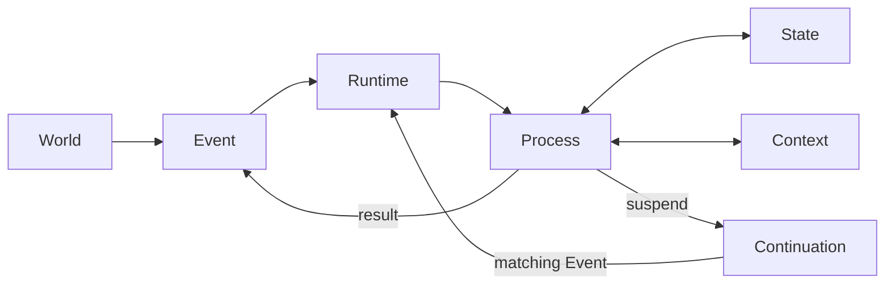

Inside the Runtime, one submitted event flows through:

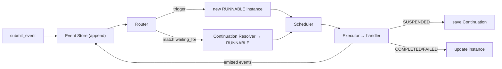

## Durability (Phase 2A)

The runtime is built to run continuously without corrupting state:

- **Atomic process transitions.** A handler stages its writes (`ctx.state.set`)
  and returns *all* effects — state changes, emitted events, continuation
  create/delete, spawned children, timers — in one `ProcessResult`. The runtime
  commits them in a single SQLite transaction, or rolls the whole batch back.
- **Idempotency.** Re-delivering an event (same id) is a no-op; committed
  activations are recorded so effects never apply twice.
- **Crash recovery.** On startup, processes left `RUNNING` by an interrupted
  run are returned to `RUNNABLE` (a committed activation always leaves `RUNNING`
  atomically, so a stuck `RUNNING` never committed and is safe to re-run).
- **Retry.** A handler raising `RetryableError` moves the process
  `RUNNING → RETRY_WAIT → RUNNABLE → COMPLETED` with exponential backoff; plain
  exceptions are terminal `FAILED`.
- **Timers.** A process can suspend on a timer (`ctx.suspend_on_timer`); a
  `runtime.tick()` fires due timers as ordinary `timer_fired` events that resume
  it. Time comes from an injectable `Clock` so tests stay fast and deterministic.
- **Spawn / join.** A process can `ctx.spawn_and_join(...)` children and suspend
  until `all`/`any` finish — expressed with the normal event + continuation
  machinery, not a new primitive.

`runtime.tick()` drives time-based work (timers, retry backoff); `submit_event`
drives event-based work. Both end by draining all `RUNNABLE` processes.

## Semantic world model (Phase 2B)

A meaning layer sits between raw events and world state, keeping four things
distinct:

| | meaning |
| --- | --- |
| **Event** | what happened |
| **Observation** | what a process *read* from the event |
| **StateDelta** | what it concluded *changed* about the world |
| **World State** | how the world is currently *believed* to be |

`Observation` and `StateDelta` are **domain data** under `nexus_seed/world/`,
not new core primitives. The pipeline is two ordinary processes:

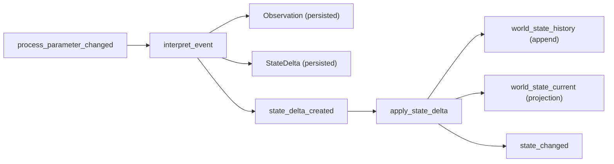

- **History is the source of truth.** `world_state_history` is append-only —
  every version of every `entity.attribute`, with `valid_from`/`valid_to`.
  `world_state_current` is a projection and is fully rebuildable with
  `runtime.rebuild_current_state()`.
- **Provenance.** Every fact records why it is believed.
  `runtime.get_state_provenance(entity, attribute)` walks
  Current → History → StateDelta → Observation → raw Event, purely from the DB.
- **Conflict-checked application.** `apply_state_delta` validates a delta's
  `old_value` against current state; a mismatch is a domain `StateConflict`
  (the process fails, nothing is applied — no partial update).
- **Atomicity preserved.** Applying a delta writes the history row, the
  projection, the delta, and emits `state_changed` inside the one Phase 2A
  transaction.

Read APIs: `get_current_state`, `get_state_history`, `get_state_at_version`,
`get_state_provenance`, `rebuild_current_state`.

## Work intelligence (Phase 2C)

NEXUS SEED now discovers the work a world change *requires* and spawns it
automatically. `Impact`, `WorkRequirement`, `WorkMatch` are **domain data**
under `nexus_seed/work/` — work is still executed as ordinary `ProcessInstance`s
(no `Task`/`Agent`/`Skill` primitive). The boundary the pipeline preserves:

| | meaning |
| --- | --- |
| **StateDelta** | the world changed |
| **Impact** | that change has these consequences |
| **WorkRequirement** | this work needs doing (a *Need*) |
| **ProcessInstance** | this work is being done |

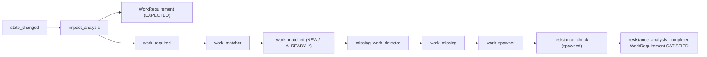

- **Separated stages.** Impact analysis never spawns; matching, missing-work
  detection and spawning are distinct processes connected by events.
- **`work_key` idempotency.** A requirement's identity includes the state
  version (`resistance_check:D1_CD:v2`), so re-processing a change never
  duplicates work, and a *new* version is genuinely new work.
- **Matching.** `work_matcher` classifies a requirement `NEW` /
  `ALREADY_RUNNING` / `ALREADY_COMPLETED` against existing processes by
  `work_key` (a suspended/running process ⇒ no re-spawn).
- **Deterministic rules only.** Impact rules and the work→process registry live
  in `work/rules.py`; the Runtime holds no domain rules.
- **Completion.** A work process marks its `WorkRequirement` `SATISFIED` as a
  declarative, atomic side effect (`ctx.satisfy_work()`).
- **Provenance / trace.** `runtime.get_work_trace(id)` walks ProcessInstance →
  WorkRequirement → StateDelta → Observation → raw Event — *why is this process
  running?*, answered from the DB.

Read APIs: `get_work_requirement`, `get_work_requirements`, `get_work_trace`.
`work_required` / `work_spawned` / `work_satisfied` events give the work loop a
causal trail. Everything (requirement persist, spawn, status updates, links,
emitted events) commits inside the Phase 2A atomic transaction.

## Context compiler / memory architecture (Phase 3A)

Processes no longer read the stores freely for their standard inputs. Instead:

```
Memory (Event / State / Observation / Delta / Work / Process / Continuation)
   → ContextRequirements (declared on the ProcessDefinition)
   → ContextCompiler
   → ProcessContextView (ctx.view)
   → Process execution
```

- **Memory** is the collective name for the persistent stores — *not* a new
  primitive. **Context** is a temporary, regenerable view compiled from Memory
  for one activation.
- **Declared needs.** A `ProcessDefinition` carries `ContextRequirements`
  (world-state entities, recent/related events, observations, deltas, work,
  process tree, continuation). No requirements ⇒ **minimal context**
  (process instance + trigger event only).
- **Selective & deterministic.** The compiler pulls only what's declared, in a
  fixed order — never the whole DB. `ctx.view` is **read-only**; writes stay in
  `ProcessResult`.
- **Fresh resume (the key property).** The view is recompiled every activation,
  so a process resumed after the world moved on sees the **current** state, not
  a suspend-time snapshot. Continuation ≠ Context: the continuation says where
  to resume; the context is recompiled from current Memory.
- **Provenance.** Every item keeps its persistent record id (event id, history
  id, delta id, work id, …).
- **Audit snapshots.** Each activation's compiled context is saved to
  `context_snapshots` (via `runtime.get_context_snapshots(id)`) — an audit of
  "what did this activation see", never used to resume.

`resistance_check` reads its standard inputs (current target, its
WorkRequirement, trigger, continuation) from `ctx.view`; `ctx.services` remains
only for special explicit queries. Requirements persist on the definition, so a
runtime rebuilt from SQLite recompiles the same context.

## LLM intelligence boundary (Phase 3B)

The LLM is a **swappable backend called from a Process** — never embedded in the
Runtime. Its output is a **Proposal**, gated before it can touch the world:

```
LLM → Proposal → Schema validation → Consistency validation → Policy
    → ACCEPT / REVIEW / REJECT
```

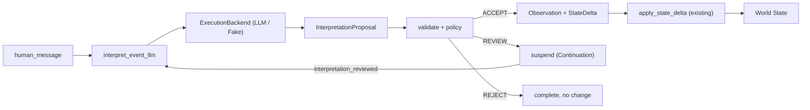

- **Strict separation.** `LLM output ≠ Observation ≠ StateDelta ≠ World State`.
  Only an **ACCEPTED** proposal becomes an Observation + StateDelta, which flow
  through the *existing* Phase 2B `apply_state_delta` — the LLM has no private
  write path (Invariants 16–19). An accepted proposal then drives the full
  Phase 2C work pipeline unchanged.
- **Swappable backend.** `ExecutionBackend` (`backends/`) maps a
  `BackendRequest` to a `BackendResult` and does nothing else. `LLMBackend`
  (reads its API key from the env) and `FakeLLMBackend` (test workhorse, no
  network) share one interface (Invariant 20). Register with
  `runtime.register_backend("llm", backend)`; handlers reach it via
  `ctx.backends`. Real LLM output is parsed as strict JSON first. If that fails,
  the output is repaired once with `json-repair` and parsed again before
  entering the unchanged proposal validation and policy boundary.
- **No-change contract.** `proposed_state_deltas` is a required response field,
  but its array may be empty. An explicit empty array means that the
  interpretation found no durable state change; it may record an accepted
  Observation but emits no `StateDelta`. A missing or malformed field follows
  the existing bounded retry path and can never be filled with an invented
  delta. Failed attempts remain in the invocation journal.
- **Policy, not Runtime.** `InterpretationPolicy` (thresholds) decides
  ACCEPT/REVIEW/REJECT from confidence; a **state conflict overrides confidence**
  and forces at least REVIEW. Schema/parse failures are **retryable** (Phase 2A
  retry); nothing partial is persisted.
- **Human review = ordinary Event + Continuation.** REVIEW suspends waiting for
  `interpretation_reviewed`; `approve` re-validates and applies, `reject` ends
  with no change, `modify` re-proposes. Survives a full runtime restart.
- **Provenance.** World value → StateDelta → Observation → InterpretationProposal
  → LLMInvocation → ContextSnapshot → raw Event, all from the DB.
- **Coexistence.** The deterministic `interpret_event` (on
  `process_parameter_changed`) and the LLM `interpret_event_llm` (on
  `human_message`) both remain available.

## Action / tool execution boundary (Phase 3C)

Phase 3B built perception (world → NEXUS SEED). Phase 3C builds the mirror
image, action (NEXUS SEED → world), on the same primitives:

```
World State / Work → Process → ActionProposal
    → Schema → Backend capability → Permission → Risk policy
    → APPROVE / REVIEW / REJECT → ExecutionBackend → ActionExecution
    → action_succeeded / action_failed → Event → World
```

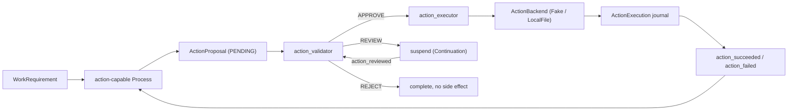

- **Four things stay distinct.** `Process intention ≠ ActionProposal ≠ approved
  proposal ≠ external side effect`. A handler's only route outward is
  `ctx.propose_action(...)`, which *stages a candidate* — it never executes
  anything (Invariants 21–22).
- **Permissions are granted to definitions, not claimed by instances.** A
  `ProcessDefinition` carries `metadata["permissions"]` (default: none). Every
  backend action type also declares **mandatory** permissions, so a proposal
  that under-declares (`required_permissions: []`) is rejected rather than
  quietly escalating.
- **Risk is configuration.** `ActionPolicy` maps `RiskLevel` →
  APPROVE/REVIEW/REJECT and lives in the validator's definition metadata;
  an unmapped level falls back to REVIEW. The Runtime holds no risk rules.
- **Human review = ordinary Event + Continuation**, as in 3B. `approve`
  **re-validates against current state** before acting; `modify` produces a new
  PENDING proposal that re-enters validation from the top. Survives a restart.
- **Safety model: at-most-once per idempotency key** — explicitly *not*
  distributed exactly-once (no 2PC). A SUCCEEDED `ActionExecution` blocks
  re-execution, and `LocalFileActionBackend` keeps a durable journal so even the
  "effect landed, commit lost" crash window does not repeat the effect.
- **Every attempt is recorded**, including failures, timeouts and idempotent
  skips — the attempt journals survive the rollback a retry causes
  (Invariant 26). Retries reuse the Phase 2A mechanism; backends never retry.
- **Results come back as Events, not state writes.** A backend result lands in
  the `ActionExecution` journal and an `action_succeeded` payload; changing
  world state still requires the ordinary Observation → StateDelta path
  (Invariants 24–25).
- **Traceable.** `runtime.get_action_trace(id)` walks execution → proposal →
  process → work → delta → observation → raw event, plus the ContextSnapshot
  the decision was made against, the permission provenance of each decision,
  and any human `action_reviewed` events.

## External observation / ingress boundary (Phase 3D)

Phase 3C let NEXUS SEED act on the world; Phase 3D lets the world reach it —
through one door, with an identity discipline strong enough that redeliveries
and restarts converge instead of duplicating:

```
External source → Adapter → IngressEnvelope
    → validation → deduplication → IngressReceipt + Raw Event
    → (the existing perception pipeline)
```

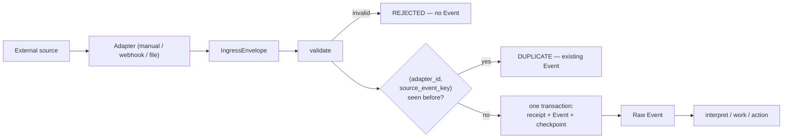

- **External identity is not our identity.** `Event.id` is what NEXUS SEED calls
  an occurrence; `source_event_key` is what the *world* calls it. A UNIQUE index
  on `(adapter_id, source_event_key)` means the database — not application
  logic — is what stops a redelivery becoming a second Event (Invariants 30–31).
  The adapter chooses that key, because only it knows what makes two
  observations "the same thing"; an envelope without one is refused rather than
  given an invented key.
- **All-or-nothing intake.** The receipt, the Event and the adapter's checkpoint
  commit in one transaction. Delivery into the Runtime happens *after* that
  commit, so a failure while processing leaves a durable, already-deduplicated
  event — never a receipt marking an occurrence handled that never ran.
- **Checkpoint ≠ Continuation** (Invariant 33). A Continuation is where *our*
  process resumes; a Checkpoint is how much of the *world* we have looked at.
  Losing a checkpoint costs a re-observation, not lost work.
- **Adapters observe, they do not interpret** (Invariant 34). The file adapter
  reports that bytes under `allowed_root` changed, with a sha256 fingerprint —
  it never opens the workbook. Interpretation stays in the perception pipeline
  where it is proposed, validated and auditable.
- **Delivery semantics:** at-least-once acquisition plus deduplication at
  ingress. No distributed exactly-once, no 2PC.
- **Three adapters ship:** manual/CLI, generic webhook (stdlib asyncio HTTP,
  shared-secret auth, duplicate → `200 {"duplicate": true}`), and a sandboxed
  local file watcher. A webhook returns as soon as the Event is durable; it
  never waits for the LLM, the work pipeline or an action.
- **Traceable in both directions.** `runtime.get_ingress_trace(event_id)` — or
  `get_ingress_trace_by_source_key(adapter_id, key)`, when all you have is the
  provider's delivery id — walks forward to the observations, deltas, work and
  actions it caused, and joins the Phase 3C action trace to close the loop.

The four idempotency mechanisms stay deliberately separate — `Event.id` (2A),
`work_key` (2C), action `idempotency_key` (3C), `source_event_key` (3D) — and
must agree without being merged into one general mechanism:

```
1 real external event → 1 Event → 1 WorkRequirement → 1 Action → 1 side effect
```

## Artifact / resource layer + long-lived observer (Phase 3E)

Phase 3D could say *that* a file changed. Phase 3E can say what it is, keep its
history, and hand a process a usable rendering of it — and it answers 3D's open
question about who does the watching.

```
External file → Ingress → file event → Resource + ResourceVersion
    → Representation → Context Compiler → Process → ActionProposal → world
```

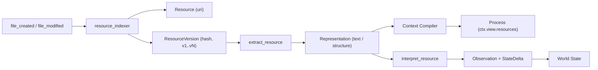

- **Three levels, kept apart.** `Resource` is what a thing *is* (unique by URI);
  `ResourceVersion` is what it *contained* at a time (immutable, numbered,
  content-hashed); `ResourceRepresentation` is what we *made* of that content.
  Collapsing any two breaks something real: a content-keyed Resource has no
  history, and a Representation attached to the Resource could never answer
  "what did the AI actually read?" once the file changed.
- **Extraction is a Process, not an engine feature** (Invariant 38). Extractors
  are pure functions in a deterministic registry (`PlainText`, `JSON`, `CSV`);
  adding Office or PDF support later is a registration, not a Runtime change.
  Adapters still never interpret content — that rule from 3D holds.
- **Two dedup rules.** A version is not created when the content hash matches
  one this Resource already has, so a watcher re-reading an unchanged file adds
  nothing. A Representation's identity includes the extractor's *version*, so
  improving an extractor produces a new rendering beside the old one rather
  than silently rewriting what a past decision was based on.
- **Documents reach a Process through the Context**, declared in
  `ContextRequirements.resources`. Selection is deterministic — explicit ids or
  URIs, process input, work metadata. **No embeddings, no similarity ranking**:
  the compiler must be reproducible for the snapshot audit to mean anything.
  `max_bytes` truncates or excludes; it never summarises.
- **Fresh resume extends to documents** (Invariant 40). A process suspended
  holding v1 of a spec resumes reading v2. The ContextSnapshot pulls the other
  way on purpose, recording the version and rendering each activation read, so
  the historical answer survives the file moving on (Invariant 39).
- **A resident observer is just a Process** (Invariant 41). `watch_files` polls
  an adapter, ingests, and suspends on a timer; between ticks it is a row in
  SQLite and a Continuation. It inherits crash recovery and restart safety for
  free, a restart resumes the same instance rather than starting a second, and
  `watch_mail` / `watch_git` would be the identical shape. No daemon
  abstraction was added.
- **One path boundary.** `ResourceScope` replaces the `allowed_root` checks that
  Phase 3C and 3D had each grown separately, with read and write as distinct
  powers. Paths only — not a sandbox.

## Durable event delivery (Phase 3F)

Storing an event is not enough. An event-driven system is only honest if every
persisted event is *guaranteed* to reach the router — otherwise a crash at the
wrong moment leaves a fact in the database that nothing will ever act on.

Phase 3E had exactly that hole: the ingress boundary committed an event with
its receipt, and the observer that was going to route it could fail afterwards.
The source key was spent, so no re-poll would bring it back.

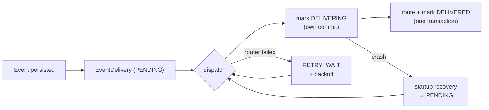

- **Persistence and delivery are separate facts** (Invariant 42). `EventDelivery`
  is one row per event, created by `EventStore.append` **in the same
  transaction as the event itself** — so no call site can persist an event and
  forget to promise that something will look at it (Invariant 43).
- **"Delivered" means the routing result committed**, not that `route()` was
  called. The acknowledgement rides in the same transaction as the activations
  it produced, so "processes created but event unacknowledged" is a state that
  cannot exist. A `trigger_event_id` guard backs it up independently.
- **Interrupted work is visible.** `DELIVERING` is committed on its own before
  routing, so a crash mid-route leaves a signature that startup recovery
  returns to `PENDING`. Same argument as Phase 2A's `RUNNING` sweep.
- **One stuck event does not stall the queue.** A delivery inside its backoff
  is skipped, not waited on; later events keep flowing.
- **At-least-once delivery, once-only outcomes.** Retry safety still comes from
  the per-layer idempotency each phase added — they stay separate rather than
  being merged into one engine.
- **`events_to_route` is gone.** An observer ingests and stops; the obligation
  carries the event onward whether that activation commits or not
  (Invariant 47). `deliver_event()` survives as an optimization only.
- **Legacy databases are backfilled as `DELIVERED`, never `PENDING`** — marking
  old events pending would replay a live system's entire history.

The result, stated precisely: *an event persisted since Phase 3F is delivered to
the router eventually, unless it is explicitly settled as FAILED.*

## Capability registry (Phase 4A)

Until now, work found its implementation by name: a `work_type` was looked up in
a hard-coded table. That works exactly as long as somebody wrote the table down
in advance. Phase 4A replaces the lookup with a question.

```
WorkRequirement → required capabilities → CapabilityRegistry
    → candidate ProcessDefinitions → deterministic matching
    → one capable process, or a recorded gap
```

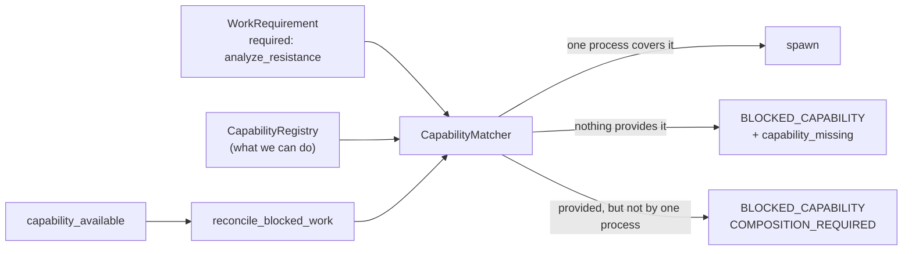

- **Two things called "capability" stay apart.** Phase 3C's
  `BackendCapabilities` is what a *tool* can mechanically do (`write_file`);
  a `Capability` here is what a *Process* can accomplish
  (`analyze_resistance`). A tool is not a competence.
- **A gap does not cancel the need.** When nothing can do the work, it becomes
  `BLOCKED_CAPABILITY` with the missing capabilities recorded — never
  `CANCELLED`. Cancelling would discard a real requirement because of a
  temporary limitation of *ours*, and acquiring the competence later could
  never bring it back. This is the record self-extension would later read.
- **Three outcomes, deliberately distinct.** Matched; *nothing provides this*;
  or *everything is provided but no single process covers it all*. The last is
  recorded, not solved — combining processes is Phase 4B, and quietly doing it
  here would smuggle in a planner.
- **Matching is exact and reproducible.** No LLM, no embeddings, no similarity
  ranking. Ties break on an explicit `capability_priority`, then the newer
  definition version, then the name — the same answer on every machine and
  after every restart. Descriptions and tags are stored but never matched on.
- **Acquiring a capability reconciles; it does not replay.** Registering a
  capable process appends `capability_available`, and the blocked *existing*
  requirements are re-offered to the matcher — same ids, same provenance, no
  raw event re-delivered.
- **Every decision is auditable.** Each attempt records the candidates weighed,
  what each was missing, what was chosen and why. Attempts accumulate, so a
  requirement blocked on Monday and matched on Tuesday shows both.
- **The old path still works.** Work that declares no capabilities falls back
  to the name table, so the existing D1_CD scenario reaches the same process —
  what changed is the selection principle, not the outcome.

Conceptually this is the other half of World State: world state is what NEXUS
SEED knows about the *outside*; the capability registry is what it knows about
*itself*. No `SelfModel` primitive was added to say so.

## Dynamic process composition (Phase 4B)

Phase 4A could find *one* process that does the whole job, and record a gap
when none existed. One of those gaps was interesting: `COMPOSITION_REQUIRED` —
every competence the work needs exists, just scattered across several
processes. Phase 4B works out an order in which they add up.

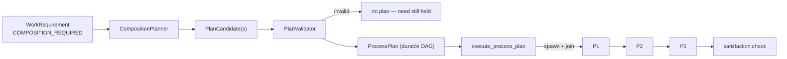

- **A PlanNode is a position, not an execution.** It names a
  ProcessDefinition; a `ProcessInstance` is still the only thing that runs, and
  execution reuses the existing spawn / join / continuation machinery. Atomic
  transitions, crash recovery and activation idempotency therefore apply to a
  composed plan without any of them learning what a plan is.
- **Deterministic, bounded, and exact.** Backward chaining from the required
  capabilities and output types; connection decided by *symbolic type equality*
  and nothing cleverer. Explicit limits on nodes, depth and candidates mean the
  search always terminates with an answer rather than hanging. **No LLM** takes
  part — before the system can reason about which arrangement is best, it needs
  a reproducible answer to whether one exists.
- **Plans are DAGs, and nothing runs one the planner merely proposed.**
  Cycles are rejected (a loop belongs inside a process). Validation happens at
  composition *and* again before each stage spawns, because a definition can be
  disabled in between.
- **A completed node is never re-run.** `(plan_id, node_key)` is unique and the
  spawn binds the node to its instance in the same transaction, so a crash
  after the first step resumes at the second — not at the beginning. Node side
  effects make this the difference between recovery and a new bug.
- **Failure does not undo, and does not cancel the need.** A failed node fails
  the plan; earlier results stand, no compensation is invented, and the
  requirement stays open.
- **All nodes complete is not the same as the work being done.** Satisfaction
  is judged separately: capability coverage *and* the required output types
  actually produced. A plan whose processes all ran but produced nothing
  required is COMPLETED and **not** SATISFIED.

Phase 4B also restructured `ProcessResult`, which had grown to some twenty
effect lists. The lists stay (every handler keeps working); `result.effects`
and `result.lifecycle` are grouping views over them, and — more importantly —
**contradictory staged effects now fail the activation** instead of being
resolved by list order. That closes a real Phase 4A bug where recording a
capability selection silently overwrote a work status set moments earlier in
the same handler.

## Composition hardening (Phase 4B.1)

Phase 4B could arrange several processes into a plan. It could not always
explain the plan it had arranged. Three things had to be true before Phase 4C
puts any judgement on top of composition, and this phase is entirely about
making them true — no new capability, no LLM, no replanning.

### An edge is the data flow, not just an ordering

Phase 4B's edge recorded *that* one node fed another and left the executor to
find a value by type at run time. With two producers of the same type the
consumer got whichever the executor happened to visit first: the plan could not
say where a value came from, and two runs of the same plan could differ.

An edge now names both ends — the producing port and the consuming port — and
the executor follows edges rather than searching by type. A **port** is written
`type` or `type:key`, so a process consuming two measurements can say which is
which:

```
measurement            any measurement
measurement:measured   the one called "measured"
```

Nothing is decided at execution time that was not decided at planning time. A
keyless port stays a wildcard on the *producing* side; on the consuming side
the declaration must match exactly, because a port's name is the key the value
arrives under.

### Ambiguity is refused, never resolved

If two nodes could feed one input and nothing says which, the planner leaves it
unbound and the validator fails the plan naming the input and both candidates.
Picking one would still *run* — which is what makes it dangerous. `BindingStatus`
separates the diagnoses that matter: `AMBIGUOUS_BINDING` (too many producers),
`MISSING_INPUT` (none), `DUPLICATE_BINDING`, `TYPE_MISMATCH`, `INVALID_PORT`.

One producer per consumer input is enforced by a UNIQUE index, not only by the
validator — and `save_edge` no longer swallows a conflicting insert. That
combination found a real Phase 4B bug: when one node fed two keyed inputs of
another, the second edge was silently dropped, the consumer ran with an input
missing, and the plan still reported success. The `plan_edges` table is rebuilt
on open to widen the constraint that caused it.

### Branching is tested, not assumed

Phase 4B implemented parallel spawn and multi-input join and then only ever ran
a straight line. `P1 → {P2, P3} → P4` is now an acceptance case: it fans out,
both branches run in one stage, the join waits for the slower one, and a
restart with one branch finished and the other interrupted mid-activation
re-attaches instead of spawning a second.

### A runtime call does a slice of work, not all of it

A drain used to run until the world stood still. Fine for short chains; not
fine for a long plan, and not fine at all for a process that can cause its own
next event — that was a hang no care elsewhere could recover from.

```python
from nexus_seed.runtime.drain import DrainBudget

await runtime.submit_event(event, DrainBudget(max_activations=10))
while runtime.last_drain.has_remaining:
    await runtime.drain(DrainBudget(max_activations=10))
```

**Reaching a budget is not a failure.** Nothing is marked FAILED, no event is
dropped, no plan is abandoned — everything is already durable, so the next call
continues. The dispatch and execute halves alternate, so a long delivery queue
cannot starve execution. The budget is a parameter of a call, never stored
state: a restarted runtime is told nothing about how the last one was paced,
and the outcome does not depend on where the slices fell.

The default is unlimited, so every pre-4B.1 caller behaves exactly as before.

### Where did this value come from?

`PlanTrace.bindings` answers that per port rather than per node, and
`inputs_given` reads back what each position was actually handed:

```python
trace = runtime.get_plan_trace(plan_id)
[b.describe() for b in trace.bindings_into("compare:v1")]
# ['measure:v1.reading:measured -> compare:v1.reading:measured',
#  'lookup_reference:v1.reading:reference -> compare:v1.reading:reference']
```

Old plans, written before bindings existed, are honoured where their meaning is
beyond doubt and BLOCKED where it is not. Guessing would reproduce exactly the
ambiguity the phase removed.

## Plan selection and replanning (Phase 4C)

Composition stays deterministic: it generates and validates a bounded set of
candidate DAGs. Phase 4C adds judgement only after that boundary:

```text
WorkRequirement
  -> validated candidate plans
  -> deterministic evaluations and hard constraints
  -> deterministic selection, or an optional LLM SelectionProposal
  -> validation / confidence policy / ordinary human-review Continuation
  -> one selected plan
  -> success, or terminal failure -> durable replan_required -> a new plan
```

The LLM never returns a graph and cannot name a plan outside its shortlist.
Unknown or drifted plans execute nothing, while backend/schema failures exhaust
the normal retry budget and then fall back to the deterministic selector.
Selections, proposals, invocation attempts, evaluations and replan attempts are
persisted for audit. A failed plan stays immutable; its WorkRequirement remains
open and is reconsidered against the current Capability Registry and freshly
compiled related World State. `max_replans` bounds the loop, ending in
`BLOCKED_PLAN` rather than cancellation.

Plan-level approval is intentionally separate from Action approval. A selected
plan that proposes a high-risk external action still stops at the Phase 3C
permission/risk boundary.

## Repository layout

```
nexus_seed/
├── core/            # data models: event, process, state, context, continuation
├── world/           # semantic domain data: observation, state_delta, provenance
├── work/            # work domain data: work_requirement, impact, work_match,
│                    #   rules, trace
├── context/         # context architecture: requirements, models (view/snapshot),
│                    #   compiler
├── backends/        # ExecutionBackend protocol + LLMBackend / FakeLLMBackend;
│                    #   ActionBackend + FakeAction / LocalFileAction
├── intelligence/    # proposal, validation, policy (the LLM boundary)
├── actions/         # action domain data: models, permissions, validation,
│                    #   policy, trace (the outward boundary)
├── ingress/         # ingress domain data: models, validation, service, trace
│                    #   (the inward boundary)
├── adapters/        # external adapters: manual, webhook, local file watcher
├── resources/       # artifact layer: models, scope, service, extractors, trace
├── delivery/        # durable event delivery: models + dispatcher
├── capabilities/    # what the system can do: models, registry, matcher, trace
├── planning/        # composition: models (incl. Port), planner, validation, trace
├── runtime/         # runtime, router, scheduler, executor, continuation_resolver,
│                    #   clock, join_coordinator, drain, services
├── storage/         # sqlite: database + event/process/state/continuation/timer/
│                    #   join/activation/observation/state_delta/work_requirement/
│                    #   context_snapshot/proposal/llm_invocation/
│                    #   action_proposal/action_execution/action_decision/
│                    #   ingress_receipt/adapter_checkpoint/resource/
│                    #   event_delivery/capability/plan
├── processes/       # concrete Processes (demo_resistance, semantic,
│                    #   work_intelligence, llm_interpret, actions, resources)
├── ingress_cli.py   # submit one external occurrence by hand
└── demo.py          # runnable acceptance scenario (with runtime restart)
tests/               # phase 1: event_store, process_execution, suspend_resume
                     # phase 2a: atomic_transition, idempotency, crash_recovery,
                     #           retry, timer_resume, spawn_join
                     # phase 2b: observation, state_delta, state_history,
                     #           state_provenance, state_conflict,
                     #           state_projection_rebuild, semantic_..._integration
                     # phase 2c: work_requirement, impact_analysis, work_matching,
                     #           missing_work_detection, work_spawn,
                     #           work_idempotency, work_trace, work_..._integration
                     # phase 3a: context_requirements, context_compiler,
                     #           context_selective_state, context_events,
                     #           context_work, context_process_tree,
                     #           context_continuation, context_fresh_resume,
                     #           context_snapshot, context_restart
                     # phase 3b: llm_backend, interpretation_proposal,
                     #           proposal_validation, proposal_policy,
                     #           llm_interpret_high_confidence, llm_interpret_review,
                     #           llm_human_approve, llm_human_reject,
                     #           llm_review_restart, llm_conflict, llm_retry,
                     #           llm_trace, llm_work_integration
                     # phase 3c: action_proposal, action_validation,
                     #           action_policy, action_permissions,
                     #           action_backend, action_auto_approve,
                     #           action_review, action_review_restart,
                     #           action_reject, action_retry,
                     #           action_idempotency, action_trace,
                     #           action_context_trace, action_file_sandbox,
                     #           action_boundary, action_work_integration,
                     #           llm_invocation_logging
                     # phase 3d: ingress_models, ingress_service,
                     #           ingress_duplicate, ingress_atomicity,
                     #           manual_adapter, webhook_adapter, webhook_auth,
                     #           file_adapter, file_adapter_restart,
                     #           file_adapter_sandbox, adapter_checkpoint,
                     #           ingress_trace, ingress_llm_integration,
                     #           ingress_closed_loop,
                     #           ingress_duplicate_closed_loop
                     # phase 3e: resource_models, resource_indexer,
                     #           resource_versioning, resource_restart,
                     #           resource_representation, representation_dedup,
                     #           representation_trace, resource_scope,
                     #           context_resources,
                     #           context_resource_fresh_resume,
                     #           context_resource_snapshot,
                     #           resource_interpretation, watch_files,
                     #           watch_files_restart, watch_files_duplicate,
                     #           resource_action_integration,
                     #           resource_semantic_loop
                     # phase 3f: event_delivery_models, _store, _dispatcher,
                     #           _retry, _restart, _starvation, _router_crash,
                     #           _ingress_gap, _process_event, _action_event,
                     #           _review_event, _timer, _resource_event,
                     #           _closed_loop, _migration, _trace
                     # phase 4a: capability_models, _store, _registry,
                     #           _matcher, _multiple_candidates, _disabled,
                     #           process_capabilities,
                     #           work_capability_missing, _reconciliation,
                     #           _restart, _audit, _trace,
                     #           capability_legacy_compat, _work_integration,
                     #           _closed_loop, _durable_delivery
                     # phase 4b: effect_conflicts, composition_planner,
                     #           plan_validation, plan_restart, plan_trace,
                     #           composed_work_integration,
                     #           composed_closed_loop
                     # phase 4b.1: plan_bindings, plan_binding_validation,
                     #           plan_binding_trace, plan_binding_migration,
                     #           plan_branching, plan_branching_restart,
                     #           plan_parallel_binding, bounded_drain,
                     #           bounded_drain_delivery, bounded_drain_plan,
                     #           bounded_drain_loop_protection,
                     #           composition_hardening_integration,
                     #           composition_hardening_restart
```

## Install

Requires Python 3.12+. The sole runtime dependency is `json-repair`, used only
as a fallback for malformed LLM JSON; tests use `pytest` + `pytest-asyncio`.

```bash
python -m venv .venv
.venv\Scripts\activate          # Windows
# source .venv/bin/activate     # macOS / Linux
pip install -e ".[dev]"
```

## Test

```bash
pytest
```

The key test is `tests/test_suspend_resume.py`: it suspends a process, **closes
and discards the Runtime**, rebuilds a new Runtime from the same SQLite file,
and only then delivers the resuming event — proving process state is fully
recovered from disk.

That same discard-and-rebuild pattern recurs at every phase boundary:
`test_llm_review_restart.py` (an LLM proposal awaiting review),
`test_action_review_restart.py` (an action awaiting approval),
`test_file_adapter_restart.py` (files already observed), and
`test_ingress_closed_loop.py` (the whole loop).

## Demo

```bash
python -m nexus_seed.demo
```

This runs the Phase 1 acceptance scenario:

1. Submit `process_parameter_changed` (`D1_CD` 48 → 45).
2. A process starts and sets world state `D1_CD.target = 45`.
3. It needs a `W03` measurement that doesn't exist yet → **suspend** with a
   continuation waiting for `measurement_completed` / `W03`.
4. **Destroy the Runtime**; only SQLite remains. Build a fresh Runtime.
5. Submit `measurement_completed` (`W03`, `123.4`).
6. The Continuation Resolver matches it and resumes the process.
7. The process completes and emits `resistance_analysis_completed`.

## Submitting one external occurrence (Phase 3D)

```bash
python -m nexus_seed.ingress_cli --db world.db \
    --event-type human_message \
    --source-event-key demo-001 \
    --payload '{"text": "D1のCD targetを48nmから45nmへ変更しました"}'
```

Running the same command twice is a no-op: the second call reports `duplicate`
and creates no second Event — the same rule a webhook redelivery obeys, made
visible at the smallest possible scale. Add `--bootstrap` to register the
standard perception + work + action stack before ingesting.

## What Phase 1 intentionally excludes

LLM / model APIs, Claude Code, OpenClaw, MCP, mail/Slack, web search, vector or
graph databases, embeddings, GUI, knowledge graph, multi-agent orchestration,
self-modification. Only the boundaries where those will later attach are in
place.

Later phases filled the LLM (3B), action (3C), observation (3D), artifact (3E),
capability (4A), composition/decision (4B–4C), self-extension proposal (5A),
sandbox construction (5B), reviewed production promotion (5C), and bounded
autonomous acquisition (5D) boundaries. Office/PDF extraction, delegation and
dynamic organization remain unbuilt. See `AGENTS.md` for later-phase candidates.

## Sandboxed capability construction (Phase 5B)

An approved self-extension can now become real, inspectable artifacts without
modifying this repository or activating the capability:

```text
ExtensionProposal APPROVED
  -> validated ConstructionPlan
  -> dedicated SandboxWorkspace + construction-scoped Grant
  -> ActionProposal-gated artifact writes
  -> Resource / ResourceVersion / Representation provenance
  -> structural + static/test + CapabilityContract verification
  -> ConstructionResult VERIFIED
```

`VERIFIED` deliberately means neither `INSTALLED` nor `ACTIVE`. The workspace
is sealed, its temporary grant is revoked, and the Capability Registry,
production ProcessDefinitions, repository and global permissions remain
unchanged. `runtime.get_construction_trace(plan_id)` joins the complete path
from blocked work through approval, actions, artifacts and verification.
Installation/activation is handled only by the separate Phase 5C boundary.

## Reviewed installation and activation (Phase 5C)

An exact verified artifact can now become a usable capability without writing
into this repository or inheriting sandbox authority:

```text
ConstructionResult VERIFIED
  -> exact ResourceVersion + content hash InstallationPlan
  -> human installation review
  -> one-plan InstallationGrant
  -> ActionProposal-gated versioned production copy
  -> post-install load/interface/permission/smoke checks
  -> atomic component + Capability activation
  -> blocked Work reconciliation -> original Work SATISFIED
```

Production files live below a dedicated
`installed_extensions/<component>/<version>/` data root. A failed smoke check
rolls back only the new version and leaves any previous active provider intact.
`runtime.get_installation_trace(plan_id)` joins the verified hashes, review,
Grant, Actions, checks, rollback/activation and original Work. The standalone
5C boundary requires review; Phase 5D may supply a recorded AUTO decision only
for its narrow safe case. Runtime self-update, policy modification,
unrestricted shell/network and automatic package/plugin installation remain
forbidden.

## Bounded autonomous capability acquisition (Phase 5D)

Phase 5D coordinates the existing 5A/5B/5C boundaries as one durable session:

```text
CapabilityGap -> AcquisitionSession -> AutonomyPolicy
  -> AUTO | REVIEW_REQUIRED | FORBIDDEN
  -> Extension validation/review -> sandbox construction/verification
  -> installation validation/Grant/Action/smoke -> activation
  -> capability_available -> blocked Work reconciliation
```

`AUTO` is deliberately narrow: by default it covers only LOW-risk reuse of an
exact existing ProcessDefinition. It still enters the ordinary review events,
revalidation, InstallationGrant, ActionProposal, verification and rollback
boundaries. New ProcessDefinitions and extractors require human review;
runtime/core/permission/policy changes and unrestricted shell/network remain
forbidden and cannot be overridden by a review event.

`CapabilityAcquisitionSession`, subscribers, append-only autonomy decisions and
attempts are stored in SQLite. Budgets bound extension depth, acquisitions per
Work, and construction/installation attempts. Recursive dependencies carry a
parent session and depth; cycles stop with `ACQUISITION_CYCLE`. Identical needs
share one acquisition while retaining every subscribing WorkRequirement.
`runtime.get_acquisition_trace(session_id)` joins policy, Work, 5A proposal,
5B evidence, 5C activation and reconciliation events across restarts.

## Provider federation and human control (Phases 5E/5G)

Phase 5E keeps semantic competence separate from operational execution:
`Capability` says what can be accomplished, `ProcessDefinition` is the
contract, and `ExecutionProvider` says who can execute it. Provider selection
is deterministic and constrained by status, health, permission, trust, cost,
latency and human directives. External output returns through durable Events
and cannot write World State or authorize an Action directly.

Phase 5G adds authenticated, schema-validated Commands and durable Goals.
Goals remain distinct from WorkRequirements. The ordinary `evaluate_goal`
Process compares current state and criteria, emits idempotent goal-gap Work,
and re-evaluates on relevant state/work Events. Explicit Control Plane
commands retain authority over pause, resume, cancellation, priority and
provider constraints; none of those commands widens Action or autonomy policy.

## Persistent Being (Phase 6)

Phase 6 adds no primitive and no replacement agent loop. It is a default-on,
feature-gated composition over the Phase 5G runtime:

```text
Event / World State / durable Goal
  -> attention_evaluation Process
  -> relevant | ignore | investigate | reconsider
  -> maintain_intention Process -> Intention World State
  -> evaluate_goal -> existing Work Intelligence -> Provider
  -> existing ActionProposal / Permission / Risk / Review boundary
  -> action/work Event -> experience_recorded Event
  -> reflect_experience -> Observation + StateDelta -> reflection_completed
  -> idle until Event, timer, retry, or Continuation is ready
```

### Self and Master

Self and Master are regenerable projections, not records competing with World
State. Self identity, concerns, commitments, questions and beliefs use normal
World State facts. Active Goals come from the Phase 5G Goal store, active
Intentions from `intention:<id>.record`, and available capabilities are read
from `CapabilityRegistry` on every projection; capability data is never copied
into World State.

Master facts are stored as `master:<id>.claim:<category>:<key>`. Every value
contains exactly one epistemic status: `OBSERVED`, `INFERRED`, or `CONFIRMED`,
plus confidence and source Event. The projection exposes goals, preferences,
projects, commitments, concerns and shared history without erasing that status.

### Attention and persistent Intention

`attention_evaluation` is an ordinary finite Process. An ignored Event is a
successful no-op and creates no Work. Relevant external Events and persisted
reconsideration conditions emit `intention_reconsideration_requested`.
Internal Phase 6 projection changes are explicitly ignored so the existence
loop cannot feed itself.

An Intention is a long-lived World State schema under an existing Goal. Its id
is deterministically derived from the Goal id, and its lifecycle is
`ACTIVE | WAITING | SATISFIED | BLOCKED | ABANDONED`. Goal lifecycle remains
owned by Phase 5G; Intention records the current pursuit and persisted wake
conditions. Goal evaluation remains the only route from a Goal gap to Work.

For a Phase 6 Goal without explicit success criteria, `evaluate_goal` first
uses the durable Intention boundary and produces a validated
`goal_decomposition_proposed` Event. Only a later activation turns that inert
proposal into concrete WorkRequirements. `advance_human_goal` is a legacy
Phase 5G fallback label, not an acquirable capability; Phase 6 never opens a
CapabilityGap for it. A concrete missing capability discovered by decomposition
continues through the unchanged Phase 5A–5D policy/budget pipeline, and
activation returns through `capability_available` and `reconcile_blocked_work`.
With no decomposition backend or explicit capability metadata, the Goal and
Intention remain durable without manufacturing Work or a capability gap.

### Experience, reflection, and safety

There is no Experience table or Core type. `record_experience` emits a durable
recipe joining situation, pre-action ContextSnapshot id, Intention/Goal/Work,
ActionProposal/Execution, reason, result and surprise. `get_experience_trace`
reconstructs the joined view from existing Event, State, Work and Action
journals. Reflection is another Process and may write a lesson only through
Observation -> StateDelta -> the existing `apply_state_delta` validator.

Self-initiated Work uses the same capability matcher, Provider selector and
ActionProposal boundary as human-requested Work. `AutonomyPolicy`, scoped
grants, Permission, Risk, Review, retries and idempotency are unchanged. Human
Control Plane commands remain authoritative.

### Feature flag, restart, and idle behavior

`NEXUS_SEED_PHASE6_ENABLED` defaults to `true`. Explicit OFF performs no Phase
6 registration and appends no wake Event, giving Phase 5G behavior. ON may append
one `existence_wakeup` during application bootstrap when an active Goal,
unresolved Intention, or unanswered Self question exists. That wake is a
durable Event obligation, not a Runtime special case. All processes are finite;
after the resulting work drains, the existing Runtime is idle rather than
polling in a busy loop. Phase 6 process failure is isolated as an ordinary
failed activation and does not disable Phase 5G command processing.

## Human Interface / Cockpit

Cockpit is an optional application-layer projection served at `/cockpit` on
the existing authenticated HTTP listener. It is not a Runtime or a seventh
primitive. `CockpitService.snapshot()` reads the Goal, Work, Process,
Continuation, Provider, Event, StateDelta and Action stores plus the existing
Self/Master/Intention projections. Snapshot compilation has no write path.

```text
existing durable stores + projections + trace links
  -> read-only CockpitService
  -> /cockpit/api/snapshot
  -> browser Overview / Being / Activity / Work / Reviews / Providers / System

browser operation -> existing POST /control -> ConsoleService
  -> schema + target + HumanIdentity permission validation
  -> existing Event / Process / StateDelta / Action / Review boundaries
```

Activity is a regenerable grouping by existing Event correlation/causation and
provenance ids. It never creates an Activity table. Human-readable errors are
presentation records paired with raw errors in drill-down details; they never
change audit facts. The API uses the configured webhook bearer token. Static
HTML contains no state and may load before authentication; snapshot and
control data remain authenticated.

Capability Assistance is another read-only projection, not an acquisition
mechanism. It joins existing Goal, Intention, WorkRequirement, CapabilityGap,
CapabilityAcquisitionSession, policy decision, attempt, Provider and Review
records. Active `AUTO` acquisition is intentionally silent. A card is emitted
only for `WAITING_REVIEW` or a terminal blocked/failed/cancelled route, and
related blocked Work is aggregated by Goal (or by missing capability when no
Goal exists). Approve/reject uses the existing review command; "defer" uses the
existing Work pause command. Raw trace remains available in the card.

`NEXUS_SEED_COCKPIT_ENABLED=false` removes the Cockpit routes while leaving
Runtime, webhook, Control Plane and CLI untouched. Self-question answers are
the only added control surface: `/answer <question-id> answer="..."` is an
authorized Phase 5G Command that emits `self_question_answered`; the ordinary
Phase 6 projection Process resolves the question through Observation and
StateDelta. The UI never writes World State or SQLite directly.

## Project Situation Projection

Project Situation is a regenerable application/domain projection, not a Core
primitive, Project store, Runtime, Goal system, or agent loop. It joins the
existing durable records without copying them:

```text
explicit project_id / Work.project
  -> Goal -> Intention
  -> Work -> Process / Continuation / Review
  -> Event correlation, causation and source provenance
  -> World State / StateDelta history
  -> ProjectSituation (read-only)
```

Association is conservative. A record enters a project only through the
existing `WorkRequirement.project` field, explicit `project_id`/`project`
metadata, a Goal/Work/Intention identifier, or an existing causal/provenance
link. Text similarity and LLM inference never establish membership. Records
without project metadata continue through the pre-existing paths and remain
unassigned in this projection.

`overall_status` is deterministic: hard Work/Goal/dependency/failure blockers
produce `BLOCKED`; pending Review or an explicitly project-scoped unresolved
question produces `NEEDS_ATTENTION`; unresolved non-blocked Goal/Intention/Work
produces `ACTIVE`; all-terminal Goals produce `COMPLETED`; otherwise it is
`IDLE`. The deterministic summary is presentation data and never replaces an
Event, StateDelta, Work status or Review record.

`GET /projects` and `GET /projects/{project_id}/situation` use the existing
HTTP bearer-token boundary. `CockpitService`, HTTP callers and Process/LLM
handlers through `RuntimeServices.get_project_situation()` use the same
projection function. Reads add no SQLite changes; restart simply reconstructs
the same result from durable source records. Cockpit disablement removes these
optional HTTP routes but does not affect Runtime operation.

Phase 7 is not implemented.
