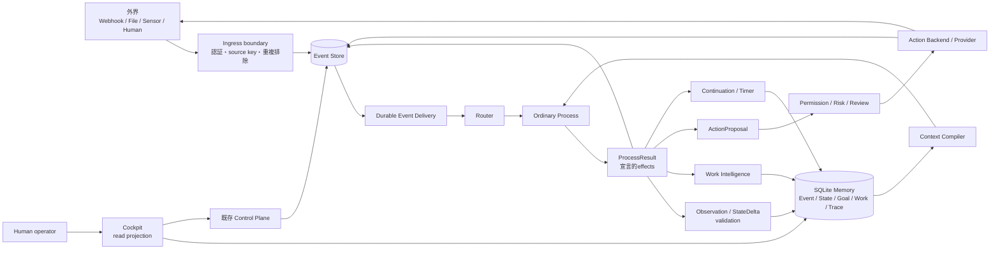
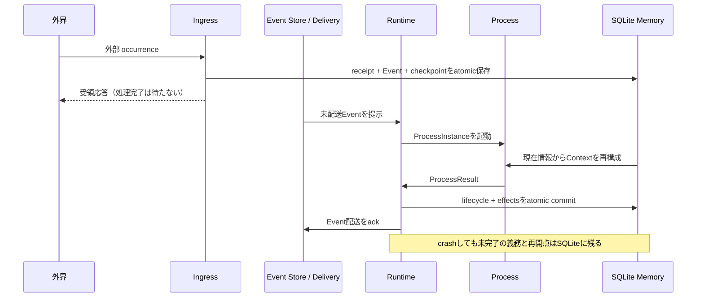
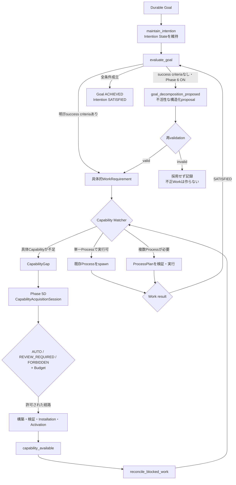
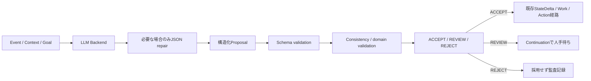
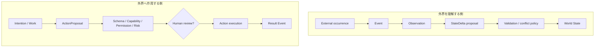
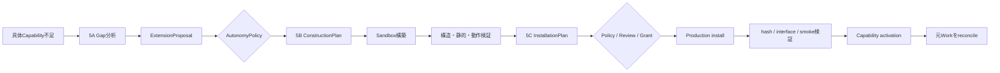
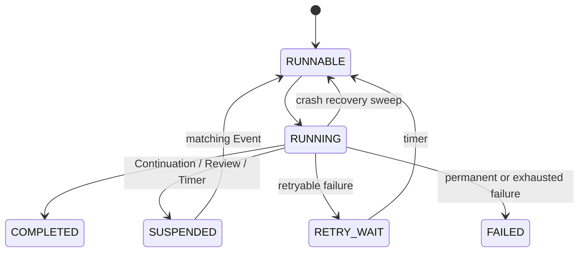
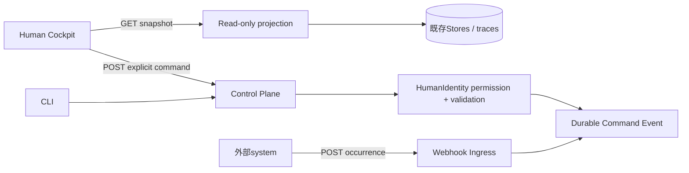
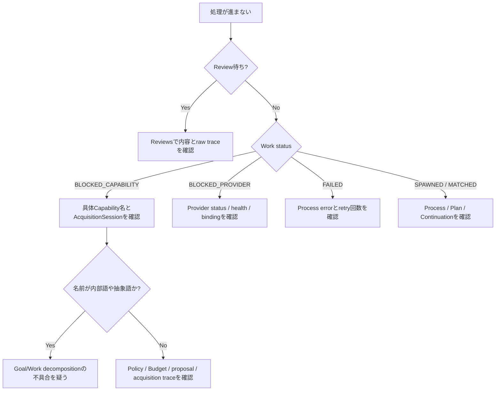

# NEXUS SEED 全体像

この文書は、NEXUS SEEDをPhase番号ではなく、**情報がどこから入り、何として記録され、
どう判断され、どの安全境界を通って外界へ作用するか**で理解するための案内です。

詳細仕様は[architecture.ja.md](architecture.ja.md)、実行方法は
[README.ja.md](../README.ja.md)を参照してください。

## まず10秒で把握する

NEXUS SEEDは「LLMを呼ぶループ」ではありません。

> 外界の出来事を永続Eventとして受け取り、必要なProcessだけを起動し、判断と副作用を
> 検証境界へ通し、途中で停止してもSQLiteから同じ論理状態へ戻るRuntimeです。

全体を一行にすると次のようになります。

```text
Observe -> Record -> Understand -> Attend -> Maintain Goal/Intention
        -> Discover Work -> Find Capability/Provider -> Act safely
        -> Record result -> Reflect -> Wait for the next Event
```

何もする必要がなければ、CPUを回し続けずEvent・timer・Continuation待ちへ戻ります。

## 固定されている6つのprimitive

Core primitiveは今後も次の6つだけです。

| Primitive | 一言でいうと | 例 |
| --- | --- | --- |
| `Event` | 起きた事実 | 外部通知、状態変更、レビュー回答、Action結果 |
| `Process` | Eventに反応して有限の処理を行う役割 | Attention、解釈、Work matching、Reflection |
| `State` | 永続的に保持する値 | World State、Intention record |
| `Context` | Process実行時にMemoryから再構成する読み取りビュー | 関連Event、現在State、対象Work、Resource |
| `Continuation` | Processが何を待っているかを表す論理的再開点 | 人手承認待ち、timer待ち、Action結果待ち |
| `Runtime` | 配送・起動・中断・復旧を行う機構 | router、scheduler、executor、recovery |

次の用語は重要ですが、Core primitiveではありません。

| 用語 | 既存primitive上での表現 |
| --- | --- |
| Goal | Control Planeの永続domain record |
| Intention | World State上の長寿命State schema |
| Self / Master | 既存State・Goal・Capabilityから作るprojection |
| Attention / Reflection | 通常のProcess role |
| Experience | Event・State・ContextSnapshot・traceから再構成可能なEvent recipe |
| WorkRequirement | 「必要だが、まだ満たされていない仕事」のdomain record |
| Capability | Processが何を実現できるかというregistry record |
| Provider | ProcessDefinitionをどこで実行できるかというbinding |
| Plan | 複数Processを接続する永続DAG |

## システム全体の地図



読み方は次のとおりです。

1. 外部入力はIngressを通らないとEventになりません。
2. 保存されたEventには、同じtransactionで配送義務が作られます。
3. Processは必要なContextを毎activation再コンパイルして読みます。
4. ProcessはSQLiteへ好き勝手に書かず、`ProcessResult`でeffectを宣言します。
5. 外部副作用は必ずActionProposalと安全判定を通ります。
6. 結果もEventとして戻るため、次の判断と監査へ接続できます。

## 一つのEventが処理されるまで



`Eventを保存した`と`EventをProcessへ届けた`は別です。後者まで永続管理することで、
保存後にprocessが落ちてもEventが忘れられません。

## Goal、Intention、Workの違い

この3つは似ていますが、寿命と責任が異なります。

| 概念 | 答える質問 | 例 |
| --- | --- | --- |
| Goal | 長期的に何を達成したいか | 「Project Aをレビュー可能にする」 |
| Intention | 今そのGoalに対して何を実現しようとしているか | 「最新測定を揃え、レビュー資料を準備する」 |
| WorkRequirement | 現在、具体的に何が必要か | 「測定を解析する」「レビュー資料を生成する」 |
| ProcessInstance | そのWorkを実際に実行しているもの | `analyze_measurements@1`の一回の実行 |

### Goalから具体的Workまで



重要な点は、`advance_human_goal`のような内部ライフサイクル語を取得しようとしないことです。
Phase 6では、既存`evaluate_goal`がGoalを具体的Workへ分解します。分解backendや明示capability
metadataがない場合は、架空のWorkやCapabilityGapを作らずGoal/Intentionを保持します。

Capability Acquisitionへ進むのは、`analyze_measurements`や`generate_review_report`のように、
**具体的Workを行うため本当に不足している能力**だけです。

## LLMはどこまで信用されるか

LLMはRuntimeの中に入っていません。LLMはProcessから呼ばれる交換可能なBackendです。



- JSON repairは構文を読み直せる形にするだけで、内容を正しいとはみなしません。
- schemaに必要な値がなければ、retryまたは安全な不採用になります。
- LLMが返したStateDelta、Work、Command、Plan、Actionは直接commitされません。
- retry中もLLM invocation journalは残ります。

## 内向きの理解と外向きのActionは鏡像



Inboundでは「見たこと」と「状態を変える提案」を分離します。Outboundでは「やりたいこと」と
「許可された副作用」を分離します。どちらも、モデルやProcessの出力がそのまま世界を変えない
ようにする境界です。

## Capability、Process、Providerの違い

```text
WorkRequirement: generate_review_report が必要
        ↓ exact deterministic matching
Capability: generate_review_report を提供できるか
        ↓
ProcessDefinition: review_report_writer@2 が意味的な実装契約
        ↓ provider selection
ExecutionProvider: local_runtime / directory_skill / external_agent
        ↓
ProcessInstance: 今回の具体的な実行
```

- Capabilityは「何ができるか」です。
- ProcessDefinitionは「その仕事をどういう入出力・権限契約で行うか」です。
- Providerは「そのProcessDefinitionをどこで実行するか」です。
- Action Backend capabilityは`write_file`など機械的操作であり、Process Capabilityとは別物です。

Providerが一時停止しているだけなら`BLOCKED_PROVIDER`です。意味的な能力自体がなければ
`BLOCKED_CAPABILITY`です。この区別により、Provider障害を誤って自己拡張しません。

## Capability Acquisitionが複雑に見える理由

Capability Acquisitionは、一つの巨大な自動処理ではありません。既存の安全境界を順番に
接続したものです。



`AUTO`は境界を省略する意味ではありません。低リスクで既存Processを再利用できる場合などに、
人間の代わりに記録付き承認を供給するだけです。以下は常に維持されます。

- `AUTO / REVIEW_REQUIRED / FORBIDDEN`の決定論的Policy
- SessionごとのBudget snapshot
- extension depth、構築attempt、installation attemptの上限
- scoped Grant、Permission、ActionPolicy
- artifact hash、sandbox、production smoke、rollback
- `capability_available`後の通常reconciliation

## 永続性と再起動



保存されるのはPython call stackではありません。ProcessInstance、入力、local state、
Continuation、待機条件、timer、Event配送義務など、再構築に必要な論理状態です。

再起動時は概ね次を行います。

1. schema migrationと旧Event delivery recordの安全なbackfill
2. 途中だったEvent deliveryを回復
3. `RUNNING`だったProcessを`RUNNABLE`へ戻す
4. due timer・retry・未配送Eventを通常経路でdrain
5. Contextを現在のMemoryから再コンパイルして再開

したがって、再開時には停止時の古いContextではなく、現在のWorld StateやResourceVersionが
見えます。

## Human Interface、Control、Webhook



- Cockpitの表示は既存Storeから作るread-only snapshotです。
- Cockpitの更新は手動です。更新ボタンを押したときだけ新しいsnapshotを取得します。
- Cockpit操作とCLIは同じControl Planeへ入ります。
- `/control`は人間の明示Command、`/ingress/webhook`は外部occurrenceの取り込みです。
- HTTP tokenは接続認証、HumanIdentity permissionはCommand認可であり、役割が異なります。

## SQLiteに何があるか

`Memory`は新しいprimitiveや単一tableの名前ではなく、次の永続Storeの総称です。

| 情報 | Source of truth / projection |
| --- | --- |
| 起きたこと | `events` + `event_deliveries` |
| 実行状態 | `process_instances`、`continuations`、`timers` |
| 世界について知っていること | `world_state_history` + `world_state_current` |
| 人間の長期目的 | `goals` |
| 現在の追求 | `intention:<id>.record` in World State |
| 必要な仕事 | `work_requirements` |
| できること | `capabilities` + `process_capabilities` |
| 実行場所 | Provider / binding / invocation records |
| 外部作用 | ActionProposal / decision / execution journal |
| 自己拡張 | Gap / proposal / construction / installation / acquisition records |
| 監査 | ContextSnapshot、LLM invocation、各decision、各trace link |

永続DB、construction、installed extensions、action journalなどは安全境界のためソースツリー外の
`NEXUS_SEED_DATA_DIR`に置きます。ソース更新とRuntime dataの削除・上書きを分離するためです。

## Cockpitで状態を見るときの対応表

| 表示 | 内部で主に見ているもの | 意味 |
| --- | --- | --- |
| Runtime ONLINE | HTTP到達 + delivery health | Runtime機構が応答している |
| Current Focus | Attention / active Intention projection | 現在何を関連事項として扱っているか |
| Active Goals | Goal Store | 長期目的がいくつ残っているか |
| Active Intentions | Intention State | 今の追求がいくつ非終端か |
| Running Work | Work + Process status | 実行中または待機中の具体作業 |
| Reviews | Continuationのreview待ち条件 | 人間の判断が必要 |
| Blocked Capability | WorkRequirement + matcher result | 具体能力が不足 |
| Blocked Provider | Provider selection result | 能力はあるが実行先がない |
| Activity | Event correlation/causation + trace join | 一つの出来事から生じた判断・作用のまとまり |
| Raw detail | 元のrecord / error / trace | 人間向け要約に置き換えられていない監査事実 |

## 問題が起きたときの読み方



よくある表示の意味:

- `schema validation failed` — LLM出力を採用できなかった。Runtime全体の故障とは限りません。
- `BLOCKED_CAPABILITY` — 仕事は必要なまま保持され、能力追加後にreconcile可能です。
- `BLOCKED_PROVIDER` — Capabilityを新規取得せずProvider回復を待ちます。
- `RETRY_WAIT` — durable retry timer待ちであり、busy loopではありません。
- `SUSPENDED` — Review、外部Event、Action結果、timerなどのContinuation待ちです。
- `FAILED` — そのProcess activationは失敗しましたが、Control PlaneやRuntime全体は利用できます。

## Phase番号を全体像へ対応させる

| 層 | 主なPhase | 役割 |
| --- | --- | --- |
| Durable mechanism | 1、2A、3F | 起動、中断、配送、retry、復旧 |
| Understanding | 2B、3A、3B | World State、Context、LLM proposal境界 |
| Work execution | 2C、4A、4B、4C | Work発見、Capability matching、Plan、選択 |
| World boundaries | 3C、3D、3E | Action、Ingress、Resource |
| Self-extension | 5A、5B、5C、5D | Gapから安全なCapability activationまで |
| Execution federation | 5E | ProcessとProviderの分離・選択 |
| Human direction | 5G | Command、Goal、Work制御、監査 |
| Persistent being | 6 | Self/Master projection、Attention、Intention、Experience、Reflection |
| Human visibility | Cockpit | 既存事実を人間向けに集約し、操作をControlへ接続 |

Phaseは別々のRuntimeではありません。すべて、同じ6 primitiveと同じSQLite durability上に
普通のProcess roleとdomain recordを積み重ねたものです。

## 最後に覚える5つ

1. **Runtimeは機構だけ**。判断はProcessに置かれます。
2. **LLM出力はproposal**。直接State・Work・Actionになりません。
3. **Goal、Intention、Work、Processは別物**。寿命と責任が異なります。
4. **不足するのは具体Capabilityだけ**。内部ライフサイクル語を自己拡張しません。
5. **すべてはEventへ戻る**。そのため監査、再起動、retry、将来の再判断を同じ経路で扱えます。
